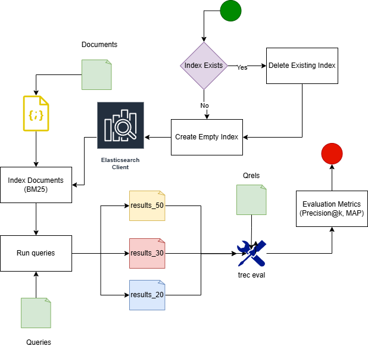
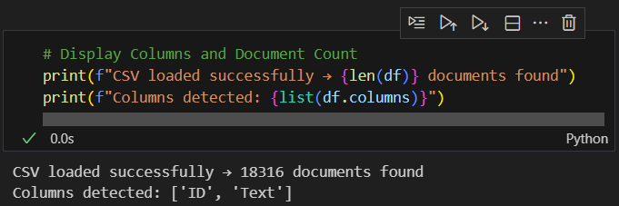
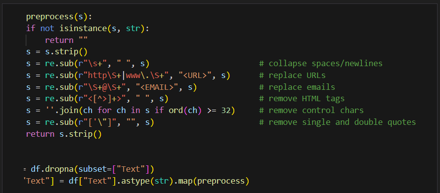
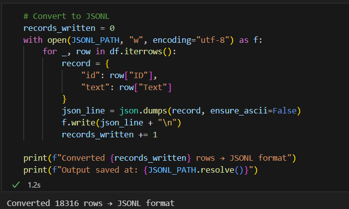
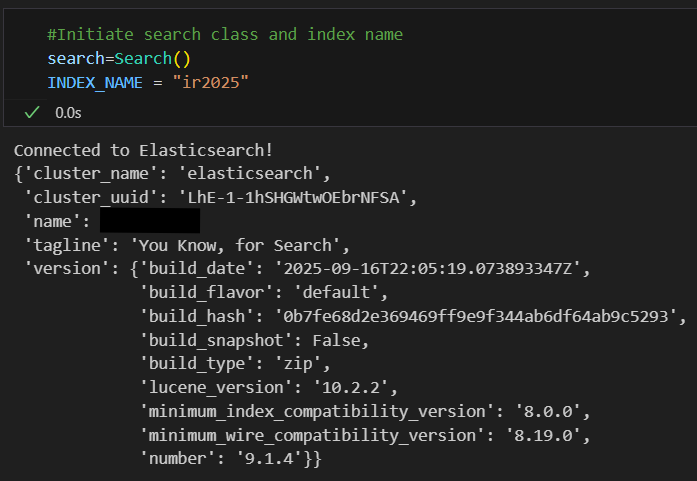
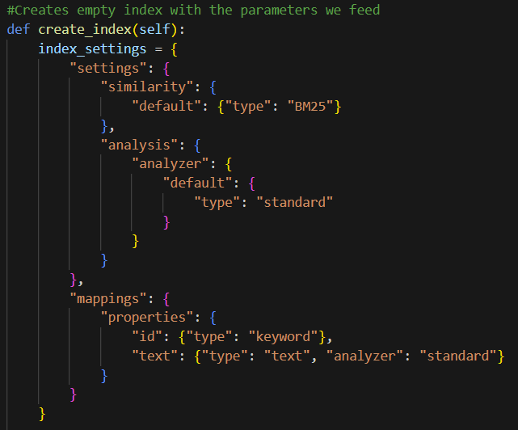
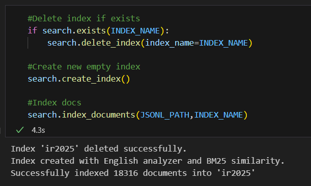

# IR2025 – Αναφορά Φάσης 1  
### Baseline Retrieval με χρήση Elasticsearch (BM25)

**Μάθημα:** Information Retrieval 2025  
**Φοιτητές(A.M.):** Περικλής Παύλου(3220158), Σωκράτης-Βησσαρίων Γιαννούτσος(3220028)  
**Καθηγήτρια:** Αντωνία Κυριακοπούλου
**Ημερομηνία Υποβολής:** 3 Δεκεμβρίου 2025  

---
## Πληροφορίες για την εργασία

Η εργασία αυτή αποτελεί την **Πρώτη Φάση (Baseline – Κλασική Ανάκτηση)** του μαθήματος *Συστήματα Ανάκτησης Πληροφοριών (IR2025)*.  
Στόχος της είναι η κατανόηση και υλοποίηση ενός συστήματος ανάκτησης πληροφορίας βασισμένου σε **κλασικά μοντέλα ανάκτησης**, όπως το πιθανοτικό μοντέλο **BM25**, μέσω της μηχανής αναζήτησης **Elasticsearch**.

Η συλλογή δεδομένων που χρησιμοποιείται είναι η **IR2025**, η οποία περιλαμβάνει **18.316 κείμενα** που βρίσκονται στο αρχείο **`documents.csv`**,  
ένα σύνολο από **ερωτήματα αναζήτησης** στο αρχείο **`queries.csv`**  
και ένα αρχείο που καθορίζει τις **συναφείς απαντήσεις (relevant documents)** για κάθε ερώτημα στο **`qrels.txt`**. 
Σκοπός είναι η δημιουργία ενός ευρετηρίου στο Elasticsearch, η εκτέλεση των ερωτημάτων της συλλογής και η εξαγωγή των **top-k αποτελεσμάτων** (k = 20, 30, 50).  
Στη συνέχεια, τα αποτελέσματα αξιολογούνται με το εργαλείο **`trec_eval`** χρησιμοποιώντας τα μέτρα **Precision@k** και **Mean Average Precision (MAP)**.

Η εργασία στοχεύει στην εξοικείωση με τη διαδικασία της **ευρετηρίασης, αναζήτησης και αξιολόγησης** ενός συστήματος ανάκτησης, ενώ παράλληλα λειτουργεί ως βάση για τις επόμενες φάσεις της σημασιολογικής και υβριδικής ανάκτησης που θα ακολουθήσουν.

---

## Διάγραμμα Ροής του Συστήματος (Framework)

To παρακάτω διάγραμμα παρουσιάζει το συνολικό **διάγραμμα ροής** του συστήματος ανάκτησης που υλοποιήθηκε γαι το πρώτο μέρος της εργασίας. Το διάγραμμα αποτυπώνει τα **σημαντικότερα στάδια** της διαδικασίας — από την εισαγωγή και ευρετηρίαση των εγγράφων έως την αξιολόγηση των αποτελεσμάτων με το εργαλείο `trec_eval` — παρουσιάζοντας συνοπτικά τη συνολική ροή του συστήματος με τρόπο πλήρη και κατανοητό.

  

*Εικόνα 1 – Διάγραμμα ροής του συστήματος ανάκτησης με Elasticsearch.*

### Περιγραφή βασικών τμημάτων του συστήματος

- **Documents**  
  Περιέχει τα έγγραφα της συλλογής `documents.csv`, τα οποία αποτελούν το σύνολο δεδομένων που θα ευρετηριαστεί.

- **Index Exists / Create Empty Index / Delete Existing Index**  
  Έλεγχος αν υπάρχει ήδη ευρετήριο στο Elasticsearch.  
  Αν υπάρχει, διαγράφεται και δημιουργείται νέο κενό ευρετήριο για καθαρή εισαγωγή.

- **Index Documents (BM25)**  
  Ευρετηρίαση όλων των εγγράφων με την βοήθεια του Elasticsearch client χρησιμοποιώντας το μοντέλο **BM25** για την εκτίμηση ομοιότητας μεταξύ ερωτήματος και κειμένων.

- **Elasticsearch Client**  
  Ο Elasticsearch client που επικοινωνεί με την υπηρεσία και διαχειρίζεται τις λειτουργίες ευρετηρίασης και αναζήτησης.

- **Run Queries**  
  Εκτέλεση των ερωτημάτων από το αρχείο `queries.csv` και παραγωγή αποτελεσμάτων για διαφορετικές τιμές k (20, 30, 50).

- **Results (results_20, results_30, results_50)**  
  Αποθήκευση των top-k εγγράφων για κάθε ερώτημα σε μορφή **TREC format**, ώστε να μπορούν να αξιολογηθούν από το εργαλείο `trec_eval`.

- **Qrels**  
  Αρχείο `qrels.txt` που περιέχει τις συσχετίσεις μεταξύ ερωτημάτων και συναφών εγγράφων (ground truth).

- **trec_eval**  
  Εργαλείο αξιολόγησης που λαμβάνει ως είσοδο τα αποτελέσματα και το αρχείο `qrels.txt`, υπολογίζοντας δείκτες **Precision@k** και **Mean Average Precision (MAP)**.

- **Evaluation Metrics (Precision@k, MAP)**  
  Παρουσίαση και ανάλυση των μετρικών αξιολόγησης που προκύπτουν από το `trec_eval`.

---
## 1️⃣ Προεπεξεργασία της Συλλογής IR2025

### 1.1 Ανάγνωση και Έλεγχος Αρχείων
**Στόχος.** Φόρτωση των αρχικών αρχείων και έλεγχος ότι το `documents.csv` έχει τα απαραίτητα πεδία πριν την επεξεργασία.

**Βήματα :**
- Έλεγχος ύπαρξης αρχείων (`documents.csv`, `queries.csv`, `qrels.txt`) σε καθορισμένα paths.  
- Φόρτωση `documents.csv` με `pd.read_csv(CSV_PATH, encoding="utf-8")` μέσα σε `try/except`.  
- Εμφάνιση βασικών πληροφοριών: πλήθος εγγράφων και λίστα στηλών.  
- Έλεγχος ότι υπάρχουν οι ελάχιστες απαιτούμενες στήλες (`ID`, `Text`) — αν λείπουν, ο κώδικας τερματίζει.

  

### 1.2 Δομή του `documents.csv` και Πολιτική για κενά
**Στόχος.** Δημιουργία της δομής όπως την αναμένει η Elastic Search και χειρισμός του κώδικα για κενά/λανθασμένα πεδία.

**Λειτουργίες κώδικα:**
- Το pipeline απαιτεί τις στήλες `ID` και `Text`.  
- Δεν γίνονται rename/πρόσθετοι μετασχηματισμοί στις υπόλοιπες στήλες — δουλεύουμε με τις κεφαλίδες όπως εμφανίζονται.  
- Εφαρμόζεται `df = df.dropna(subset=["Text"])` — εγγραφές χωρίς `Text` απορρίπτονται πριν την εξαγωγή.

### 1.3 Καθαρισμός κειμένου — `preprocess`
**Στόχος.** Εφαρμογή των καθαριστικών μετασχηματισμών που υλοποιεί η συνάρτηση `preprocess` στον κώδικα. Κάθε `Text` περνάει από αυτήν την συνάρτηση πριν γραφτεί στο JSONL διότι με αυτό τον τρόπο καθαρίζουμε όσο το δυνατόν καλύτερα τα κείμενα μας αυξάνοντας αρκετά τις μετρικές που βρήκαμε στο τέλος.

**Τι κάνει η `preprocess` (όπως υλοποιείται)**
- Συμπίεση whitespace / newlines.  
- Αντικατάσταση URLs με `<URL>`.  
- Αντικατάσταση email με `<EMAIL>`.  
- Αφαίρεση HTML tags.  
- Αφαίρεση control characters (χαρακτήρες με ord < 32).  
- Αφαίρεση μονών/διπλών εισαγωγικών.

  

### 1.4 Μετατροπή σε Μορφή JSONL
**Στόχος.** Εξαγωγή των προ-επεξεργασμένων εγγράφων σε `documents.jsonl` με πεδία `id` και `text`.

**Βήματα**
- Γραφή κάθε εγγραφής ως μία γραμμή JSON: `{"id": row["ID"], "text": row["Text"]}`.  
- Μέτρηση και εκτύπωση πόσων εγγραφών γράφτηκαν.  
- Εμφάνιση του πλήρους path όπου αποθηκεύτηκε το `documents.jsonl`.

  

---

## 2️⃣ Δημιουργία Ευρετηρίου στο Elasticsearch

### 2.1 Ρυθμίσεις και Δημιουργία Ευρετηρίου (`create_index`)
**Στόχος.** Δημιουργία ενός νέου ευρετηρίου με όνομα `ir2025` στο Elasticsearch, με τις κατάλληλες ρυθμίσεις για BM25 similarity και standard analyzer.

**Βήματα**
- Σύνδεση στον Elasticsearch client: `Elasticsearch("http://127.0.0.1:9200")`.  
- Εκτύπωση πληροφοριών για το cluster (όνομα, έκδοση, lucene version κ.λπ.).  
- Αν υπάρχει ήδη ευρετήριο με το ίδιο όνομα, διαγράφεται πριν δημιουργηθεί καινούριο.  
- Δημιουργία ευρετηρίου με:
  - **Similarity:** BM25 (προεπιλογή για κλασικό IR baseline).  
  - **Analyzer:** `standard`, κατάλληλος για γενική επεξεργασία αγγλικών κειμένων.  
  - **Mapping:** `id` ως `keyword` και `text` ως `text` με τον ορισμένο analyzer.

  

### 2.2 Mapping και Analyzer του Ευρετηρίου

**Στόχος.** Ορισμός της δομής (mapping) και του τρόπου ανάλυσης των πεδίων του ευρετηρίου.

**Όπως ορίζεται στον κώδικα**
- Πεδίο `id` → τύπος `keyword` (δεν αναλύεται, χρησιμοποιείται ως μοναδικό αναγνωριστικό).  
- Πεδίο `text` → τύπος `text` με analyzer `"standard"` ώστε να γίνεται σωστά το tokenization(π.χ. κεφαλαία σε πέζα,αφαίρεση σημείων στίξης κλπ).  
- Χρήση BM25 ως similarity metric για υπολογισμό σχετικότητας μεταξύ ερωτήματος και εγγράφου.

  

### 2.3 Εισαγωγή Εγγράφων (`Index Documents`)

**Στόχος.** Εισαγωγή όλων των εγγράφων από το αρχείο `documents.jsonl` στο ευρετήριο `ir2025` που δημιουργήθηκε στο Elasticsearch.

**Βήματα που υλοποιεί ο κώδικας**
- Ορίζεται η μέθοδος `index_documents(jsonl_path, index_name)` στην κλάση `Search`.  
- Διαβάζει κάθε γραμμή του αρχείου `documents.jsonl` μέσω της συνάρτησης `generate_actions`, η οποία μετατρέπει κάθε εγγραφή σε action για μαζική εισαγωγή (bulk insert).  
- Εκτελείται η εντολή `helpers.bulk()` για ταχεία ευρετηρίαση όλων των εγγράφων.  
- Εκτυπώνεται στο console το πλήθος των εγγράφων που εισήχθησαν επιτυχώς στο ευρετήριο.

### 2.4 Έλεγχος Υπαρξης και Διαχείριση Ευρετηρίου (`Index Exists`, `Delete Existing Index`)

**Στόχος.** Έλεγχος αν υπάρχει ήδη ευρετήριο `ir2025` και διαγραφή του πριν τη δημιουργία νέου, ώστε να εξασφαλιστεί καθαρό περιβάλλον για κάθε εκτέλεση.

**Όσα γίνονται στον κώδικα**
- Καλείται `search.exists(INDEX_NAME)` για να ελεγχθεί αν υπάρχει ήδη το ευρετήριο.  
- Αν υπάρχει, εκτελείται `search.delete_index(index_name=INDEX_NAME)` για τη διαγραφή του.  
- Μετά τη διαγραφή, δημιουργείται νέο ευρετήριο με τις ίδιες ρυθμίσεις (BM25 similarity και standard analyzer).

  

---

## 3️⃣ Εκτέλεση Ερωτημάτων και Δημιουργία Αποτελεσμάτων

### 3.1 Περιγραφή Ερωτημάτων
### 3.2 Εκτέλεση Αναζητήσεων (`search_query`)
### 3.3 Αποθήκευση Αποτελεσμάτων σε TREC Format
### 3.4 Δημιουργία Αρχείων `results_20`, `results_30`, `results_50`

---

## 4️⃣ Αξιολόγηση Αποτελεσμάτων με το `trec_eval`

### 4.1 Περιγραφή και Λειτουργία του `trec_eval`
### 4.2 Εκτέλεση Αξιολόγησης
### 4.3 Μετρικές Αξιολόγησης (Precision@k, MAP)
### 4.4 Παρουσίαση και Ερμηνεία Αποτελεσμάτων

  

---

## 5️⃣ Συζήτηση και Παρατηρήσεις

---

## 6️⃣ Συμπεράσματα και Επόμενα Βήματα

---

## 🧩 Appendix (Προαιρετικό)

### A.1 Κλάση `Search` (Ευρετηρίαση και Αναζήτηση)
### A.2 Κλάση `Evaluate` (Αξιολόγηση Αποτελεσμάτων)
### A.3 Απόσπασμα Κώδικα – Δημιουργία Ευρετηρίου
