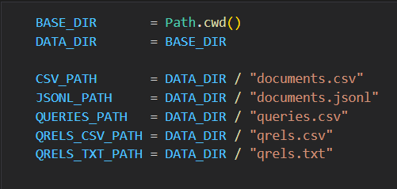
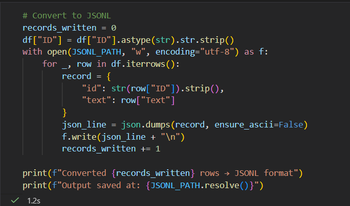

# IR2025 – Αναφορά Φάσης 1  
### Baseline Retrieval με χρήση Elasticsearch (BM25)

**Μάθημα:** Information Retrieval 2025  
**Φοιτητές(A.M.):** Περικλής Παύλου(3220158), Σωκράτης-Βησσαρίων Γιαννούτσος(3220028)  
**Καθηγήτρια:** Αντωνία Κυριακοπούλου
**Ημερομηνία Υποβολής:** 3 Δεκεμβρίου 2025  

---
## Πληροφορίες για την εργασία

Η εργασία αυτή αποτελεί την **Πρώτη Φάση (Baseline – Κλασική Ανάκτηση)** του μαθήματος *Συστήματα Ανάκτησης Πληροφοριών (IR2025)*.  
Στόχος της είναι η κατανόηση και υλοποίηση ενός συστήματος ανάκτησης πληροφορίας βασισμένου σε **κλασικά μοντέλα ανάκτησης**, όπως το πιθανοτικό μοντέλο **BM25**, μέσω της μηχανής αναζήτησης **Elasticsearch**.

Η συλλογή δεδομένων που χρησιμοποιείται είναι η **IR2025**, η οποία περιλαμβάνει **18.316 κείμενα** που βρίσκονται στο αρχείο **`documents.csv`**,  
ένα σύνολο από **ερωτήματα αναζήτησης** στο αρχείο **`queries.csv`**  
και ένα αρχείο που καθορίζει τις **συναφείς απαντήσεις (relevant documents)** για κάθε ερώτημα στο **`qrels.txt`**. 
Σκοπός είναι η δημιουργία ενός ευρετηρίου στο Elasticsearch, η εκτέλεση των ερωτημάτων της συλλογής και η εξαγωγή των **top-k αποτελεσμάτων** (k = 20, 30, 50).  
Στη συνέχεια, τα αποτελέσματα αξιολογούνται με το εργαλείο **`trec_eval`** χρησιμοποιώντας τα μέτρα **Precision@k** και **Mean Average Precision (MAP)**.

Η εργασία στοχεύει στην εξοικείωση με τη διαδικασία της **ευρετηρίασης, αναζήτησης και αξιολόγησης** ενός συστήματος ανάκτησης, ενώ παράλληλα λειτουργεί ως βάση για τις επόμενες φάσεις της σημασιολογικής και υβριδικής ανάκτησης που θα ακολουθήσουν.

---

## Διάγραμμα Ροής του Συστήματος (Framework)

To παρακάτω διάγραμμα παρουσιάζει το συνολικό **διάγραμμα ροής** του συστήματος ανάκτησης που υλοποιήθηκε γαι το πρώτο μέρος της εργασίας. Το διάγραμμα αποτυπώνει τα **σημαντικότερα στάδια** της διαδικασίας — από την εισαγωγή και ευρετηρίαση των εγγράφων έως την αξιολόγηση των αποτελεσμάτων με το εργαλείο `trec_eval` — παρουσιάζοντας συνοπτικά τη συνολική ροή του συστήματος με τρόπο πλήρη και κατανοητό.

<p align="center">
  
</p>

*Εικόνα 1 – Διάγραμμα ροής του συστήματος ανάκτησης με Elasticsearch.*

### Περιγραφή βασικών τμημάτων του συστήματος

- **Documents**  
  Περιέχει τα έγγραφα της συλλογής `documents.csv`, τα οποία αποτελούν το σύνολο δεδομένων που θα ευρετηριαστεί.

- **Index Exists / Create Empty Index / Delete Existing Index**  
  Έλεγχος αν υπάρχει ήδη ευρετήριο στο Elasticsearch.  
  Αν υπάρχει, διαγράφεται και δημιουργείται νέο κενό ευρετήριο για καθαρή εισαγωγή.

- **Index Documents (BM25)**  
  Ευρετηρίαση όλων των εγγράφων με την βοήθεια του Elasticsearch client χρησιμοποιώντας το μοντέλο **BM25** για την εκτίμηση ομοιότητας μεταξύ ερωτήματος και κειμένων.

- **Elasticsearch Client**  
  Ο Elasticsearch client που επικοινωνεί με την υπηρεσία και διαχειρίζεται τις λειτουργίες ευρετηρίασης και αναζήτησης.

- **Run Queries**  
  Εκτέλεση των ερωτημάτων από το αρχείο `queries.csv` και παραγωγή αποτελεσμάτων για διαφορετικές τιμές k (20, 30, 50).

- **Results (results_20, results_30, results_50)**  
  Αποθήκευση των top-k εγγράφων για κάθε ερώτημα σε μορφή **TREC format**, ώστε να μπορούν να αξιολογηθούν από το εργαλείο `trec_eval`.

- **Qrels**  
  Αρχείο `qrels.txt` που περιέχει τις συσχετίσεις μεταξύ ερωτημάτων και συναφών εγγράφων (ground truth) και ένα αρχείο που καθορίζει τις σχετικές απαντήσεις (relevance judgments) για κάθε ερώτημα στο **`qrels.csv`**..

- **trec_eval**  
  Εργαλείο αξιολόγησης που λαμβάνει ως είσοδο τα αποτελέσματα και το αρχείο `qrels.txt`, υπολογίζοντας δείκτες **Precision@k** και **Mean Average Precision (MAP)**.

- **Evaluation Metrics (Precision@k, MAP)**  
  Παρουσίαση και ανάλυση των μετρικών αξιολόγησης που προκύπτουν από το `trec_eval`.

---
## 1️⃣ Προεπεξεργασία της Συλλογής IR2025

Η φάση προεπεξεργασίας στοχεύει στην οργάνωση των αρχείων εισόδου, στον καθαρισμό του κειμένου, και στη μετατροπή των εγγράφων σε κατάλληλη μορφή για ευρετηρίαση στο Elasticsearch. Τα παρακάτω βήματα βασίζονται αποκλειστικά στον κώδικα που υλοποιήθηκε στο project.

## 1.1 Ανάγνωση και Έλεγχος Αρχείων

Σε αυτό το βήμα ορίζονται όλες οι βασικές διαδρομές αρχείων (paths) της εργασίας ποθ θα μας χρησιμεύσουν σε δυναμική κλήση αρχείων σε μελλοντικά στάδια.

### Τι κάνει ο κώδικας

- Ορίζει τους βασικούς φακέλους:
  - **BASE_DIR**: ο φάκελος όπου εκτελείται το notebook.
  - **DATA_DIR**: ίδιος με το BASE_DIR και χρησιμοποιείται ως ο κεντρικός χώρος αποθήκευσης όλων των αρχείων.

- Ορίζει paths για όλα τα βασικά αρχεία του pipeline:
  - **documents.csv** → περιέχει τα αρχικά κείμενα της συλλογής.
  - **documents.jsonl** → το αρχείο που θα παραχθεί μετά την προεπεξεργασία για indexing.
  - **queries.csv** → το σύνολο των ερωτημάτων αξιολόγησης.
  - **qrels.csv** → τα αρχικά qrels στη μη επεξεργασμένη μορφή.
  - **qrels.txt** → τα qrels σε μορφή TREC (δημιουργούνται αυτόματα αν δεν υπάρχουν).

- Φορτώνει το `documents.csv` στην μεταβλητή `df` και πραγματοποιεί κρίσιμους ελέγχους:
  - Εμφανίζει πόσα έγγραφα βρέθηκαν.
  - Εμφανίζει τις στήλες του αρχείου.
  - Επιβεβαιώνει ότι υπάρχουν οι απαιτούμενες στήλες **ID** και **Text**.
    - Αν λείπουν, η διαδικασία σταματά άμεσα.

<p align="center">
  
</p>

## 1.2 Δομή του `documents.csv` και Έλεγχος Απαραίτητων Πεδίων
Σε αυτό το στάδιο το pipeline ελέγχει ότι το αρχείο **documents.csv** έχει τη σωστή δομή πριν συνεχιστεί η επεξεργασία.

### Τι ελέγχει ο κώδικας

- Το σύστημα απαιτεί **αυστηρά δύο βασικές στήλες**:
  - `ID` — μοναδικό αναγνωριστικό εγγράφου
  - `Text` — το περιεχόμενο του εγγράφου

- Ο κώδικας εντοπίζει αν κάποια από αυτές λείπει:
  - Αν λείπει έστω και μία από τις απαιτούμενες στήλες, η εκτέλεση **σταματάει άμεσα** με μήνυμα λάθους.
  - Αυτό προστατεύει το pipeline από indexing σε λάθος μορφοποιημένα δεδομένα.

### Πολιτική για κενές τιμές

- Εγγραφές χωρίς τιμή στο πεδίο `Text` δεν μπορούν να ευρετηριαστούν στο Elasticsearch.
- Ο κώδικας αφαιρεί αυτόματα αυτές τις εγγραφές με: 
```python
 df = df.dropna(subset=["Text"])
```

### 1.3 Καθαρισμός κειμένου — `preprocess`

Σε αυτό το βήμα εφαρμόζεται η συνάρτηση **`preprocess`**, η οποία καθαρίζει κάθε τιμή του πεδίου `Text` πριν σταλεί για ευρετηρίαση.

### Τι κάνει η συνάρτηση

Η `preprocess` εκτελεί μια σειρά από βασικούς καθαρισμούς:

- Αφαιρεί leading/trailing κενά και συμπιέζει πολλαπλά κενά σε ένα.
- Αντικαθιστά URLs με το placeholder `<URL>`.
- Αντικαθιστά email addresses με `<EMAIL>`.
- Αφαιρεί HTML tags.
- Διαγράφει control characters (μη εκτυπώσιμους).
- Αφαιρεί μονά και διπλά εισαγωγικά.

Κάθε κείμενο καθαρίζεται με την εντολή: 
```python
df["Text"] = df["Text"].astype(str).map(preprocess)
```
<p align="center">
  
</p>

### 1.4 Μετατροπή σε Μορφή JSONL

Σε αυτό το στάδιο τα καθαρισμένα έγγραφα γράφονται στο αρχείο **`documents.jsonl`**, όπου κάθε γραμμή είναι ένα ανεξάρτητο JSON αντικείμενο.

### Τι κάνει ο κώδικας

- Μετατρέπει το πεδίο `ID` σε καθαρή string μορφή (`astype(str).str.strip()`).
- Για κάθε γραμμή του DataFrame δημιουργεί ένα dictionary:
```json
  {"id": "...", "text": "..."}
```
<p align="center">
  
</p>

## 2️⃣ Δημιουργία Ευρετηρίου στο Elasticsearch

---

## 2.1 Δημιουργία Ευρετηρίου (`create_index`)

**Στόχος.** Σύνδεση στο Elasticsearch και δημιουργία ενός νέου ευρετηρίου με όνομα `IR2025`.

### Τι κάνει αυτό το βήμα
- Συνδέεται στο cluster μέσω `Elasticsearch("http://127.0.0.1:9200")`.
- Εμφανίζει πληροφορίες σύνδεσης (όνομα cluster, έκδοση, lucene version).
- Αν υπάρχει ήδη ευρετήριο `IR2025`, διαγράφεται.
- Ξεκινά η διαδικασία δημιουργίας (οι ρυθμίσεις BM25 και analyzer εξηγούνται στο επόμενο subsection).

<p align="center">
  
</p>

---

## 2.2 Ρυθμίσεις BM25, Analyzer και Mapping

**Στόχος.** Ορισμός του τρόπου ανάλυσης και αξιολόγησης των εγγράφων στο ευρετήριο.

### Τι περιλαμβάνει

#### 🔹 BM25 (k1 = 1.4, b = 0.7)
- **k1 (term saturation):** Ρυθμίζει πόσο επηρεάζει η συχνότητα εμφάνισης μιας λέξης στο έγγραφο.  
  Τιμή 1.4 δίνει ισορροπία ανάμεσα σε “πολύ μεγάλη” και “πολύ μικρή” επίδραση της συχνότητας.
- **b (length normalization):** Ελέγχει πόσο επηρεάζει το μήκος του εγγράφου.  
  Η τιμή 0.7 είναι μια συνηθισμένη επιλογή για συλλογές με ποικιλία μεγέθους κειμένων, ώστε τα μακρύτερα έγγραφα να μην ευνοούνται υπερβολικά. Δοκιμάζοντας διάφορες τιμές, καταλήξαμε στο ότι αυτές παράγουν τα πιο ισσοροπημένα αποτελέσματα.

#### 🔹 Custom English Analyzer
- **standard tokenizer:** Σπάει το κείμενο σε λέξεις με αξιόπιστο τρόπο για αγγλικά κείμενα.
- **lowercase:** Όλα τα tokens σε πεζά → αποφεύγουμε να θεωρούνται διαφορετικά οι "House" και "house".
- **english_stop:** Αφαιρούνται κοινές λέξεις όπως *the, and, in* που δεν συμβάλλουν στη σημασιολογική διάκριση.
- **porter_stem:** Μειώνει τις λέξεις στη ρίζα τους (e.g., "running" → "run") ώστε διαφορετικές μορφές της ίδιας λέξης να ταιριάζουν.

#### 🔹 Mapping
- `id` ως `keyword` ώστε να μην αναλύεται και να χρησιμοποιείται ως σταθερό μοναδικό αναγνωριστικό.
- `text` ως `text` για να επιτρέπεται ανάλυση, stemming και scoring από το BM25.

### 🔹 Σύνοψη
Οι συγκεκριμένες ρυθμίσεις επιλέγονται ώστε το ευρετήριο να είναι **σταθερό**, **αποδοτικό** και **προσαρμοσμένο σε αγγλικά κείμενα**.  
Ο συνδυασμός BM25 + English analyzer παρατηρούμε πως βελτιώνει τη σχετικότητα των αναζητήσεων, μειώνει θόρυβο στο κείμενο και βοηθά το σύστημα να εντοπίζει πιο σωστές αντιστοιχίες μεταξύ `queries` και `docs`.


### Κώδικας Ρυθμίσεων Ευρετηρίου

```python
index_settings = {
    "settings": {
        "similarity": {
            "default": {"type": "BM25", "k1": 1.4, "b": 0.7}
        },
        "analysis": {
            "analyzer": {
                "my_english_analyzer": {
                    "type": "custom",
                    "tokenizer": "standard",
                    "filter": ["lowercase", "english_stop", "porter_stem"]
                }
            },
            "filter": {
                "english_stop": {
                    "type": "stop",
                    "stopwords": "_english_"
                }
            }
        }
    },
    "mappings": {
        "properties": {
            "id":   {"type": "keyword"},
            "text": {"type": "text", "analyzer": "my_english_analyzer"}
        }
    }
}
```
### 2.3 Εισαγωγή Εγγράφων στο Ευρετήριο (`Index Documents`)

**Στόχος.** Να φορτωθούν όλα τα έγγραφα από το `documents.jsonl` στο νέο ευρετήριο `ir2025`.

### Πώς λειτουργεί (σύμφωνα με την κλάση `Search`)
- Η μέθοδος `index_documents(...)` καλεί εσωτερικά την `generate_actions`, η οποία:
  - διαβάζει το αρχείο JSONL γραμμή-γραμμή,
  - μετατρέπει κάθε γραμμή σε *bulk action* για το Elasticsearch,
  - εξασφαλίζει ότι το `id` είναι καθαρό και χρησιμοποιείται ως `_id`.
- Η `helpers.bulk(...)` εκτελεί όλες τις εισαγωγές ταυτόχρονα, ώστε η διαδικασία να είναι πολύ πιο γρήγορη από το single insert.
- Μετά την ολοκλήρωση, εμφανίζεται μήνυμα με τον ακριβή αριθμό εγγράφων που ευρετηριάστηκαν επιτυχώς.

Το αποτέλεσμα είναι πλήρης και γρήγορη ευρετηρίαση όλων των documents.

---

### 2.4 Έλεγχος και Διαχείριση Ευρετηρίου (`Index Exists` / `Delete Index`)

**Στόχος.** Να εξασφαλίζεται ότι κάθε εκτέλεση ξεκινά από «καθαρό» ευρετήριο.

### Πώς λειτουργεί (σύμφωνα με την κλάση `Search`)
- Η `exists(index_name)` ελέγχει αν υπάρχει ήδη ευρετήριο με αυτό το όνομα.
- Αν υπάρχει, η `delete_index(index_name)` το διαγράφει πλήρως από τον Elasticsearch.
- Στη συνέχεια καλείται η `create_index()`, η οποία ξαναδημιουργεί το ίδιο ευρετήριο με τις ρυθμίσεις BM25 και τον custom English analyzer.
- Τέλος, καλείται ξανά η διαδικασία εισαγωγής εγγράφων.

### Σύνδεση με το παραπάνω screenshot
Το screenshot δείχνει ακριβώς αυτή τη ροή:

1. **Έλεγχος ύπαρξης ευρετηρίου**  
2. **Διαγραφή παλιού ευρετηρίου**  
3. **Δημιουργία νέου κενού ευρετηρίου**  
4. **Εισαγωγή εγγράφων**

<p align="center">
  
</p>

**Συνοπτικό σχόλιο.**  
Η λειτουργικότητα που περιγράφεται στην Ενότητα 2 (δημιουργία ευρετηρίου, διαγραφή, έλεγχος ύπαρξης, bulk εισαγωγή και αναζήτηση) υλοποιείται πλήρως στην κλάση `Search`.  
Μπορείς να δεις ολόκληρο τον κώδικα εδώ:

👉 [Πλήρης κώδικας της κλάσης `Search` (Appendix A.1)](#appendix-search)

---

## 3️⃣ Αξιολόγηση με trec_eval

Η ενότητα αυτή περιγράφει πώς αξιολογείται το σύστημα ανάκτησης με το εργαλείο **trec_eval**, μέσω της κλάσης `Evaluation`, των αρχείων αποτελεσμάτων `results_k.txt` και του αρχείου qrels.

---

## 3.1 Δημιουργία Αρχείων Αποτελεσμάτων (`results_k.txt`)

**Στόχος:** Εκτέλεση των queries από το `queries.csv` και παραγωγή αρχείων αποτελεσμάτων σε TREC-format για k = 20, 30, 50.

### Πώς λειτουργεί
- Φορτώνονται τα queries από το CSV.
- Για κάθε query γίνεται αναζήτηση με `search_query()`.
- Για κάθε `k` δημιουργείται αρχείο `results_k.txt`.
- Κάθε γραμμή γράφεται σε TREC run format:

```python
qid Q0 docid rank score BM25
```
- Τα αρχεία αποθηκεύονται στο directory της εργασίας και επιβεβαιώνονται με μηνύματα:
`Created results file: results_20.txt`.

<p align="center">

</p>

---

## 3.2 Εκτέλεση trec_eval

**Στόχος:** Υπολογισμός των μετρικών **MAP** και **P@k** για κάθε αρχείο αποτελεσμάτων.

### Πώς λειτουργεί
- Για κάθε `results_k.txt` κατασκευάζεται εντολή:

<p align="center">

</p>

- Η μέθοδος `_run_trec_eval_for_file()`:
- εκτελεί το `trec_eval.exe` μέσω subprocess,
- αναλύει το output,
- εξάγει:
  - MAP (Υπολογίζει τον μέσο όρο της Average Precision (AP) σε όλα τα queries.)
  - P@5, P@10, P@15, P@20 (Μετρά το ποσοστό σχετικών εγγράφων μέσα στα k πρώτα αποτελέσματα που επιστρέφει το σύστημα.)
- επιστρέφει τις τιμές ως dictionary.
- Όλα τα paths εμφανίζονται **σε σχετική μορφή** (π.χ. `trec_eval/trec_eval.exe`) χάρη στη μέθοδο `_rel()`.
- Παρακάτω βλέπετε τον κώδικα της `_run_trec_eval_for_file`:

```python
def _run_trec_eval_for_file(self, results_file: Path):
        # Stop if the results file does not exist
        if not results_file.exists():
            raise SystemExit(f"results file not found: {results_file}")

        # Build the trec_eval command using relative paths
        cmd = (
            f"{self._rel(self.trec_eval_bin)} "
            f"{self._rel(self.qrels_txt_path)} "
            f"{self._rel(results_file)} -m all_trec"
        )
        print("Running:", cmd)
        # Execute trec_eval as a subprocess
        proc = subprocess.run(cmd, capture_output=True, text=True)

        # Handle execution errors
        if proc.returncode != 0:
            print("--- trec_eval stderr ---")
            print(proc.stderr)
            raise SystemExit(f"trec_eval failed for {results_file} (rc={proc.returncode})")

        parsed = {}

        # Parse trec_eval output line-by-line
        for line in proc.stdout.strip().splitlines():
            parts = re.split(r"\s+", line.strip())
            if len(parts) < 3:
                continue

            metric = parts[0]    
            target = parts[1]      
            value_str = parts[-1] 

            # Only process metrics for the global target 'all'
            if target.lower() != "all":
                continue

            #MAP
            if metric.lower().startswith("map") and metric.lower() == "map":
                try:
                    parsed["MAP"] = float(value_str)
                except ValueError:
                    pass
                continue

            #P@k metrics (P_5, P_10, P_15, P_20)
            m = re.match(r"^P_(\d+)$", metric)
            if m:
                k = int(m.group(1))
                key = f"P@{k}"
                try:
                    parsed[key] = float(value_str)
                except ValueError:
                    pass
                continue

        # Return metrics
        return {
            "P@5":  parsed.get("P@5"),
            "P@10": parsed.get("P@10"),
            "P@15": parsed.get("P@15"),
            "P@20": parsed.get("P@20"),
            "MAP":  parsed.get("MAP"),
        }
```

---

## 3.3 Συγκεντρωτικός Πίνακας Αποτελεσμάτων

**Στόχος:** Οργάνωση των μετρικών σε πίνακα και αποθήκευση στο αρχείο `trec_eval_summary.txt`.

### Τι κάνει ο κώδικας
- Συγκεντρώνει τα αποτελέσματα σε `DataFrame` με στήλες:
`retrieval_k`, `P@5`, `P@10`, `P@15`, `P@20`, `MAP`.
- Εμφανίζει συνοπτικό πίνακα στο terminal.
- Αποθηκεύει τα αποτελέσματα σε TREC-style layout στο `trec_eval_summary.txt`.


| retrieval_k |  P@5 | P@10 |  P@15 | P@20 |   MAP   |
|-------------|------|------|-------|------|---------|
|     20      | 0.90 | 0.74 | 0.7133| 0.645| 0.7129  |
|     30      | 0.90 | 0.74 | 0.7133| 0.645| 0.7749  |
|     50      | 0.90 | 0.74 | 0.7133| 0.645| 0.7923  |

### Τα αποτελέσματα αυτά δημιουργούνται επίσης για τα αρχεία `results_30` και `results_50`.

---

## 3.4 Κλήσεις της Κλάσης Evaluation

Οι παρακάτω κλήσεις ενεργοποιούν **ολόκληρο** το pipeline αξιολόγησης:  
δημιουργία αρχείων αποτελεσμάτων (results_k.txt), εκτέλεση του `trec_eval` και εξαγωγή συγκεντρωτικών μετρικών.

<p align="center">
  
</p>

### Τι κάνει η κλάση `Evaluation` (σύντομα)

- **Αρχικοποίηση:**  
  Εντοπίζει τα αρχεία `qrels.csv` και `qrels.txt`, δημιουργεί TREC-format qrels αν χρειάζεται και βρίσκει το εκτελέσιμο `trec_eval.exe`.

- **Παραγωγή αποτελεσμάτων:**  
  Η `generate_file_results()` φορτώνει τα queries και δημιουργεί τα αρχεία  
  `results_20.txt`, `results_30.txt`, `results_50.txt` σε TREC run format.

- **Αξιολόγηση με trec_eval:**  
  Η `evaluate_with_trec_eval()` τρέχει το `trec_eval` για κάθε αρχείο και εξάγει τις
  μετρικές **P@5, P@10, P@15, P@20 και MAP**.

- **Τελική έξοδος:**  
  Επιστρέφεται DataFrame με όλες τις μετρικές και παράγεται το αρχείο  
  `trec_eval_summary.txt`.

### Με αυτές τις δύο κλήσεις ολοκληρώνεται ολόκληρη η διαδικασία αξιολόγησης του συστήματος BM25.

---

## 4️⃣ Αξιολόγηση Αποτελεσμάτων με το `trec_eval`

### 4.1 Τι είναι το `trec_eval` (σύντομα)

- Το **`trec_eval`** είναι το κλασικό εργαλείο αξιολόγησης συστημάτων IR.  
- Λαμβάνει ως είσοδο:
  - TREC-formatted αρχεία αποτελεσμάτων (`results_k.txt`)
  - Το αρχείο relevance judgments `qrels.txt`
- Υπολογίζει βασικές μετρικές:
  - **P@k (Precision at k)** – ποιο ποσοστό των top-k αποτελεσμάτων είναι σχετικά  
  - **MAP (Mean Average Precision)** – μέτρο της συνολικής απόδοσης και ταξινόμησης του συστήματος

---

### 4.2 Εκτέλεση Αξιολόγησης

- Τα αρχεία `results_20.txt`, `results_30.txt`, `results_50.txt` δημιουργήθηκαν από τη `generate_file_results()`.
- Κάθε αρχείο έχει TREC run format (`qid Q0 docid rank score BM25`) όπως αναφέραμε και πορηγουμένως.
- Η `evaluate_with_trec_eval()` εκτελεί το `trec_eval` για όλα τα k και εξάγει:
  - **P@5, P@10, P@15, P@20**
  - **MAP**
- Τα αποτελέσματα καταγράφονται στον πίνακα και αποθηκεύονται στο `trec_eval_summary.txt`.

---

### 4.3 Παρουσίαση και Ερμηνεία Αποτελεσμάτων

- Παρακάτω φαίνεται η γραφική απεικόνιση των τιμών **P@k** και **MAP** για τιμές *k = 20, 30, 50*.

- Παρατηρούμε ότι:

  - Οι τιμές **P@5 = 0.90**, **P@10 = 0.74**, **P@15 = 0.7133** και **P@20 = 0.645** παραμένουν **απόλυτα σταθερές** και για τα τρία k.  
    Αυτό δείχνει ότι το ευρετήριο επιστρέφει σχεδόν *ακριβώς τα ίδια κορυφαία σχετικά έγγραφα* στις πρώτες θέσεις ανεξάρτητα από το πλήθος των τελικών ανακτώμενων αποτελεσμάτων (k).  
    Με άλλα λόγια: η ποιότητα των **top αποτελεσμάτων** είναι ήδη πολύ υψηλή και δεν επηρεάζεται από το αν αναζητούμε 20, 30 ή 50 αποτελέσματα.

  - Αντίθετα, η τιμή **MAP** παρουσιάζει ξεκάθαρο ανοδικό μοτίβο:
    - MAP@20  → **0.7129**  
    - MAP@30  → **0.7749**  
    - MAP@50  → **0.7923**

    Όσο αυξάνεται το *k*:
    - το σύστημα επιστρέφει περισσότερα σχετικά έγγραφα (relevant documents)  
    - κάποια από αυτά εμφανίζονται σε καλύτερες σχετικές θέσεις (rank positions)  
    - άρα ο μέσος όρος precision σε όλο το ranking βελτιώνεται.

    Η MAP λαμβάνει υπόψη *όλα* τα σχετικά έγγραφα και τις θέσεις τους στο ranking.  
    Όταν αυξάνουμε το *k* και το σύστημα έχει διαθέσιμα περισσότερα σχετικά έγγραφα να εμφανίσει, η συνολική "ποιότητα ταξινόμησης" του ευρετηρίου γίνεται καλύτερη.

- Συμπέρασμα:  
  Αν και οι κορυφαίες θέσεις (P@5–P@20) παραμένουν ίδιες, καθώς το ευρετήριο εντοπίζει ήδη τα πιο σχετικά έγγραφα, όσο αυξάνεται το retrieval depth *k*, αποκαλύπτονται περισσότερα σχετικά έγγραφα σε χαμηλότερες θέσεις. Αυτό επιτρέπει στη MAP να αποτυπώσει πιο πλήρως την ποιότητα ταξινόμησης, οδηγώντας σε σταδιακή αύξησή της.

<p align="center">
  
</p>


---

## 5️⃣ Συζήτηση και Παρατηρήσεις

---

## 6️⃣ Συμπεράσματα και Επόμενα Βήματα

---

## 🧩 Appendix (Προαιρετικό)

### A.1 Κλάση `Search` (Ευρετηρίαση και Αναζήτηση)
<a name="appendix-search"></a>

### A.2 Κλάση `Evaluate` (Αξιολόγηση Αποτελεσμάτων)
### A.3 Απόσπασμα Κώδικα – Δημιουργία Ευρετηρίου
