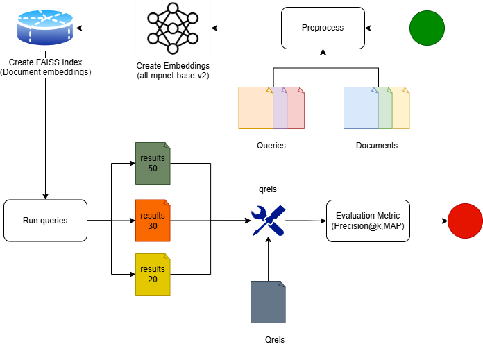

# IR2025 – Αναφορά Φάσης 2

### Semantic Retrieval με χρήση Sentence-Transformers + FAISS

**Μάθημα:** Information Retrieval 2025  
**Φοιτητές(A.M.):** Περικλής Παύλου (3220158), Σωκράτης-Βησσαρίων Γιαννούτσος (3220028)  
**Καθηγήτρια:** Αντωνία Κυριακοπούλου  
**Ημερομηνία Υποβολής:** 18 Ιανουαρίου 2026

---

## Πληροφορίες για την εργασία

Η παρούσα αναφορά αφορά τη **Φάση 2 (Semantic Retrieval)** του μαθήματος *IR2025*.  
Σε αντίθεση με τη Φάση 1 (Baseline BM25/Elasticsearch), εδώ υλοποιείται **σημασιολογική ανάκτηση** με:

- **Transformer embeddings** (Sentence-Transformers: `all-mpnet-base-v2`)
- **FAISS** για γρήγορη αναζήτηση ομοιότητας σε διανυσματικό χώρο
- Παραγωγή top-k αποτελεσμάτων για **k = 20, 30, 50**
- Αξιολόγηση με **`trec_eval`** στα **P@k (5/10/15/20)** και **MAP**

Η συλλογή δεδομένων είναι η **IR2025**:
- `documents.csv` (18.316 κείμενα)
- `queries.csv` (ερωτήματα)
- `qrels.txt` (relevance judgments, TREC format)

---

## Διάγραμμα Ροής του Συστήματος (Framework)

Το παρακάτω διάγραμμα αποτυπώνει τη ροή της Φάσης 2, από την προεπεξεργασία έως την αξιολόγηση.

<p align="center">
  
</p>

### Περιγραφή βασικών τμημάτων

- **Documents / Queries**  
  Είσοδος από `IR2025/documents.csv` και `IR2025/queries.csv`.

- **Preprocess**  
  Καθαρισμός κειμένου πριν το encoding.

- **Sentence-Transformer Encoder**  
  Μετατροπή κειμένων σε embeddings (διάνυσμα χαρακτηριστικών) με `all-mpnet-base-v2`.

- **Embeddings Cache**  
  Αποθήκευση embeddings σε `.npy` (ώστε να μη γίνεται encode κάθε φορά).

- **FAISS Index (IVF Flat + Cosine/IP)**  
  Κατασκευή index και αναζήτηση nearest neighbors.

- **Results (results_faiss_20/30/50)**  
  Αποθήκευση αποτελεσμάτων σε **TREC run format**.

- **Qrels + trec_eval**  
  Αξιολόγηση αποτελεσμάτων με τις μετρικές **P@k** και **MAP**.

> **Κοινό με Φάση 1:** Το κομμάτι **qrels + trec_eval + parsing μετρικών** είναι το ίδιο pipeline αξιολόγησης (ίδια λογική και ίδια δομή κώδικα), με μόνη διαφορά τα ονόματα των αρχείων αποτελεσμάτων (`results_faiss_k.txt` αντί `results_k.txt`).

---

## 1️⃣ Προεπεξεργασία της Συλλογής IR2025

Η προεπεξεργασία στοχεύει στον βασικό καθαρισμό κειμένου και στην ομογενοποίηση IDs. Γίνεται με τον ίδιο τρόπο και την ίδια συνάρτηση που χρησιμοποιήθηκε και στην πρώτη φάση.

---

### 1.1 Ανάγνωση & Έλεγχος Αρχείων

Ορίζονται paths για:
- `IR2025/documents.csv`, `IR2025/queries.csv`
- φάκελος `Embeddings/` για caching
- qrels & trec_eval paths

```python
BASE_DIR = Path.cwd()
IR_DIR = BASE_DIR / "IR2025"
EMBED_DIR = BASE_DIR / "Embeddings"
EMBED_DIR.mkdir(exist_ok=True)

DOCS_CSV = IR_DIR / "documents.csv"
QUERIES_CSV = IR_DIR / "queries.csv"
DOC_EMBED_FILE = EMBED_DIR / "doc_embeddings.npy"
QUERY_EMBED_FILE = EMBED_DIR / "query_embeddings.npy"

QRELS_CSV = IR_DIR / "qrels.csv"
QRELS_TXT = IR_DIR / "qrels.txt"
TREC_EVAL_BIN = IR_DIR / "trec_eval" / "trec_eval.exe"
```

---

## 1.2 Καθαρισμός κειμένου — `preprocess`

Χρησιμοποιείται συνάρτηση `preprocess` για:

- **συμπίεση κενών** (πολλαπλά spaces/newlines → ένα space)
- **αφαίρεση** HTML tags, control characters και quotes
- **βασική κανονικοποίηση** URLs και emails (αντικατάσταση με placeholders)

```python
def preprocess(s):
    if not isinstance(s, str):
        return ""
    s = s.strip()
    s = re.sub(r"\s+", " ", s)
    s = re.sub(r"http\S+|www\.\S+", "<URL>", s)
    s = re.sub(r"\S+@\S+", "<EMAIL>", s)
    s = re.sub(r"<[^>]+>", " ", s)
    s = ''.join(ch for ch in s if ord(ch) >= 32)
    s = re.sub(r"['\"]", "", s)
    return s.strip()
```

> Κοινό με Φάση 1: Η preprocess είναι η ίδια λογική/μοτίβο καθαρισμού που χρησιμοποιήθηκε και στο Μέρος Α (ίδια λειτουργία και ίδια μορφή κώδικα).

---

## 1.3 Εφαρμογή `preprocess` σε Documents & Queries

Στο βήμα αυτό φορτώνουμε τα αρχεία **documents** και **queries** από CSV και εφαρμόζουμε
τον ίδιο καθαρισμό κειμένου (`preprocess`) και στα δύο.

- Διαβάζουμε τα CSV σε DataFrames (`df_docs`, `df_queries`)
- Αφαιρούμε εγγραφές με κενό `Text` (`dropna`)
- Εφαρμόζουμε `preprocess` στο `Text`
- Κάνουμε canonical τα IDs (`astype(str).str.strip()`)

```python
df_docs = pd.read_csv(DOCS_CSV)
df_queries = pd.read_csv(QUERIES_CSV)

df_docs = df_docs.dropna(subset=["Text"]).copy()
df_docs["Text"] = df_docs["Text"].astype(str).map(preprocess)
df_docs["ID"] = df_docs["ID"].astype(str).str.strip()

df_queries = df_queries.dropna(subset=["Text"]).copy()
df_queries["Text"] = df_queries["Text"].astype(str).map(preprocess)
df_queries["ID"] = df_queries["ID"].astype(str).str.strip()
```

---

## 2️⃣ Δημιουργία Embeddings (Sentence-Transformers)

---

### 2.1 Επιλογή μοντέλου & χρήση GPU/CPU

Στο βήμα αυτό ορίζεται ο μηχανισμός παραγωγής των embeddings για documents και queries.

- Χρησιμοποιείται το pretrained μοντέλο **`all-mpnet-base-v2`** από τη βιβλιοθήκη Sentence-Transformers.
- Το runtime επιλέγει αυτόματα:
  - **`cuda`** αν υπάρχει διαθέσιμη GPU (μέσω PyTorch)
  - **`cpu`** αν δεν υπάρχει GPU

```python
device = "cuda" if torch.cuda.is_available() else "cpu"
model = SentenceTransformer("all-mpnet-base-v2", device=device)
```

---

### 2.2 Παραγωγή & caching embeddings (`.npy`)

Στο βήμα αυτό υλοποιείται μηχανισμός **caching** για τα embeddings των documents και των queries,
ώστε να αποφεύγεται ο επαναυπολογισμός τους σε κάθε εκτέλεση.

Η λογική είναι η εξής:

- Αν τα αρχεία embeddings (`.npy`) υπάρχουν ήδη στον δίσκο:
  - φορτώνονται απευθείας στη μνήμη
  - παραλείπεται ο υπολογισμός embeddings (σημαντική εξοικονόμηση χρόνου)
- Αν δεν υπάρχουν:
  - υπολογίζονται με `model.encode(...)`
  - αποθηκεύονται σε αρχεία `.npy` για μελλοντική χρήση

Η διαδικασία υλοποιείται μέσω της συνάρτησης `load_or_create_embeddings`.

```python
def load_or_create_embeddings():
    if DOC_EMBED_FILE.exists() and QUERY_EMBED_FILE.exists():
        doc_emb = np.load(DOC_EMBED_FILE)
        query_emb = np.load(QUERY_EMBED_FILE)
        return doc_emb, query_emb

    doc_emb = model.encode(
        df_docs["Text"].tolist(),
        batch_size=DOC_BATCH,
        convert_to_numpy=True,
        show_progress_bar=True
    )
    np.save(DOC_EMBED_FILE, doc_emb)

    query_emb = model.encode(
        df_queries["Text"].tolist(),
        batch_size=QUERY_BATCH,
        convert_to_numpy=True,
        show_progress_bar=True
    )
    np.save(QUERY_EMBED_FILE, query_emb)

    return doc_emb, query_emb
```

Σημεία προσοχής:

- Τα embeddings αποθηκεύονται σε μορφή NumPy arrays (.npy)

- Χρησιμοποιούνται διαφορετικά batch sizes για documents και queries

---

## 3️⃣ Κατασκευή FAISS Index

Στο στάδιο αυτό κατασκευάζεται ο διανυσματικός δείκτης που θα χρησιμοποιηθεί για
**semantic retrieval** πάνω στα embeddings των documents.

Η βιβλιοθήκη **FAISS** επιτρέπει γρήγορη αναζήτηση πλησιέστερων γειτόνων
(Approximate Nearest Neighbor Search) σε μεγάλους χώρους διανυσμάτων.

---

### 3.1 Cosine similarity μέσω Inner Product

Η αναζήτηση βασίζεται στη **cosine similarity** μεταξύ query και document embeddings.

Για να υλοποιηθεί cosine similarity στο FAISS:

- εφαρμόζεται **L2-normalization** στα embeddings
- χρησιμοποιείται **Inner Product (dot product)** ως metric

Με L2-normalized vectors ισχύει:
cosine(q, d) = q · d

```python
faiss.normalize_L2(embeddings)
```

Με αυτόν τον τρόπο αποφεύγεται η ανάγκη custom cosine metric και αξιοποιείται
η αποδοτική υλοποίηση του FAISS.

---

### 3.2 IVF Index (`IndexIVFFlat`)

Για αποδοτική αναζήτηση χρησιμοποιείται δείκτης τύπου **IVF (Inverted File Index)**,
ο οποίος επιτρέπει γρήγορη approximate αναζήτηση σε μεγάλο πλήθος διανυσμάτων.

**Χαρακτηριστικά του δείκτη:**

- **Quantizer:** `IndexFlatIP`
- **Index type:** `IndexIVFFlat`
- **Metric:** `INNER_PRODUCT` (σε L2-normalized vectors → cosine similarity)
- **nlist = 100:** αριθμός clusters (inverted lists) που χωρίζουν τον χώρο των embeddings.
- **nprobe = 10:** πόσα clusters εξετάζονται σε κάθε query.

```python
def build_faiss_index(embeddings, save_path=None, nlist=100, nprobe=10):
    emb = embeddings.astype("float32")
    dim = emb.shape[1]

    faiss.normalize_L2(emb)
    quantizer = faiss.IndexFlatIP(dim)
    index = faiss.IndexIVFFlat(
        quantizer,
        dim,
        nlist,
        faiss.METRIC_INNER_PRODUCT
    )

    index.train(emb)
    index.add(emb)
    index.nprobe = nprobe

    if save_path:
        faiss.write_index(index, str(save_path))

    return index
```
---

### 3.3 Δημιουργία και αρχικοποίηση FAISS Index

Στο υποβήμα αυτό γίνεται η **πραγματική κατασκευή** του FAISS index χρησιμοποιώντας
τα embeddings των documents που έχουν ήδη παραχθεί.

Η διαδικασία περιλαμβάνει:

- χρήση των document embeddings ως είσοδο
- εκπαίδευση (training) του IVF index πάνω στα embeddings
- εισαγωγή (add) όλων των document vectors στον index
- ρύθμιση του `nprobe` ώστε να καθοριστεί το trade-off ταχύτητας / ακρίβειας

Ο index που προκύπτει χρησιμοποιείται σε όλα τα επόμενα στάδια ανάκτησης.

```python
index = build_faiss_index(
    doc_embeddings,
    nlist=100,
    nprobe=10
)
```
Σημειώσεις:

- Η εκπαίδευση `(index.train)` απαιτεί να έχουν φορτωθεί όλα τα embeddings στη μνήμη

- Μετά το `index.add`, ο δείκτης είναι έτοιμος για αναζητήσεις

- Το `nprobe` μπορεί να αυξηθεί για καλύτερο recall με κόστος την ταχύτητα

---

## 4️⃣ Ανάκτηση (Retrieval) & Παραγωγή Results Files

Στο στάδιο αυτό πραγματοποιείται η **semantic ανάκτηση** εγγράφων χρησιμοποιώντας
τον FAISS index και τα embeddings των queries.  
Το αποτέλεσμα είναι η παραγωγή αρχείων αποτελεσμάτων σε **TREC run format**,
ώστε να μπορούν να αξιολογηθούν απευθείας με το `trec_eval`.

---

### 4.1 Παραγωγή TREC results για k = 20, 30, 50

Για κάθε query της συλλογής:

- λαμβάνεται το αντίστοιχο query embedding
- γίνεται L2-normalization στα query embeddings (ώστε inner product ≡ cosine similarity)
- εκτελείται αναζήτηση στο FAISS index (`index.search`)
- επιστρέφονται οι πλησιέστεροι document vectors
- γίνεται αντιστοίχιση:
  - **FAISS doc index → πραγματικό document ID** μέσω `df_docs`
- τα αποτελέσματα γράφονται σε αρχεία:
  - `results_faiss_20.txt`
  - `results_faiss_30.txt`
  - `results_faiss_50.txt`

Η μορφή κάθε γραμμής ακολουθεί αυστηρά το **TREC run format**:

*qid Q0 docid rank score FAISS*


```python
def generate_faiss_results(
    df_docs,
    df_queries,
    query_embeddings,
    index,
    ks=(20, 30, 50),
    prf_enabled=False
):
    faiss.normalize_L2(query_embeddings)

    for k in ks:
        out_file = IR_DIR / f"results_faiss_{k}.txt"
        with open(out_file, "w", encoding="utf-8") as outf:
            for q_idx, row in df_queries.iterrows():
                qid = str(row["ID"])
                q_vec = query_embeddings[q_idx].astype("float32").reshape(1, -1)

                D, I = index.search(q_vec, max(ks))

                for rank, (doc_idx, score) in enumerate(
                    zip(I[0][:k], D[0][:k]), start=1
                ):
                    docid = str(df_docs.iloc[doc_idx]["ID"])
                    outf.write(
                        f"{qid} Q0 {docid} {rank} {float(score):.6f} FAISS\n"
                    )
```
Σημαντικά σημεία:

- Η αναζήτηση γίνεται εξ ολοκλήρου στον FAISS index

- Τα scores που επιστρέφονται είναι inner product values
(ισοδύναμα με cosine similarity λόγω L2-normalization)

- Η μορφή των results αρχείων είναι ίδια με τη Φάση 1

---

### 4.2 PRF – Pseudo Relevance Feedback

Στο Μέρος Β έχει υλοποιηθεί προαιρετικά μηχανισμός **Pseudo Relevance Feedback (PRF)**,
ο οποίος στο τελικό run είναι **απενεργοποιημένος** (`PRF_ENABLED = False`), ώστε να αξιολογηθεί καθαρά
το baseline **Semantic Retrieval (Embeddings + FAISS)** χωρίς πρόσθετη επέκταση query.


Η λογική του PRF είναι η εξής:

- Για κάθε αρχικό query:
  - ανακτούμε έναν μεγαλύτερο αριθμό υποψήφιων documents
  - επιλέγουμε τα top-m πιο σχετικά (π.χ. `top_m = 5`)
- Υπολογίζουμε το **μέσο embedding** αυτών των documents
- Δημιουργούμε **expanded query** ως γραμμικό συνδυασμό:
  - αρχικού query embedding
  - μέσου embedding των top-m documents

Ο τύπος είναι:

```text
q_expanded = α · q + β · mean(d₁, d₂, …, dₘ)
```

```python
def expand_query_with_prf(
    q_emb,
    index,
    top_m=5,
    alpha=0.7,
    beta=0.3,
    candidate_pool=200
):
    q = q_emb.astype("float32")
    faiss.normalize_L2(q.reshape(1, -1))

    _, I = index.search(q.reshape(1, -1), candidate_pool)
    top_idxs = I[0][:top_m]
    if len(top_idxs) == 0:
        return q_emb

    top_embs = doc_embeddings[top_idxs].astype("float32")
    faiss.normalize_L2(top_embs)
    feedback_mean = top_embs.mean(axis=0)

    expanded = alpha * q_emb + beta * feedback_mean
    expanded /= (np.linalg.norm(expanded) + 1e-12)
    return expanded
```

Σημαντικά σημεία:

> Το PRF επηρεάζει μόνο το query embedding (expanded query). Η παραγωγή αποτελεσμάτων παραμένει σε TREC run format όπως και στη Φάση 1.

---

## 5️⃣ Αξιολόγηση Semantic Retrieval με `trec_eval`

Στο στάδιο αυτό αξιολογείται το σύστημα **semantic retrieval** (FAISS + embeddings)
χρησιμοποιώντας το ίδιο εργαλείο αξιολόγησης με τη Φάση 1, δηλαδή το **`trec_eval`**.
Με αυτόν τον τρόπο διασφαλίζεται άμεση και δίκαιη σύγκριση με το BM25 baseline.

---

### 5.1 Κλάση `Evaluation` (κοινή με Φάση 1)

Η κλάση `Evaluation` που χρησιμοποιείται στο Μέρος Β είναι **ουσιαστικά ίδια**
με αυτή της Φάσης 1.

Αναλαμβάνει πλήρως:

- τον έλεγχο ύπαρξης του αρχείου `qrels.txt`
  - ή τη δημιουργία του από `qrels.csv` αν δεν υπάρχει
- την εκτέλεση του `trec_eval` μέσω `subprocess`
- την εξαγωγή και ανάλυση μόνο των βασικών μετρικών:
  - `P@5`, `P@10`, `P@15`, `P@20`
  - `MAP`

Η **μοναδική διαφορά** σε σχέση με τη Φάση 1 είναι ότι εδώ διαβάζονται
τα αρχεία αποτελεσμάτων:

- `results_faiss_20.txt`
- `results_faiss_30.txt`
- `results_faiss_50.txt`

αντί για τα `results_{k}.txt` του BM25.

```python
def _run_trec_eval_for_file(self, results_file: Path):
    cmd = (
        f"{self._rel(self.trec_eval_bin)} "
        f"{self._rel(self.qrels_txt_path)} "
        f"{self._rel(results_file)} -m all_trec"
    )
    proc = subprocess.run(cmd, capture_output=True, text=True)

    parsed = {}
    for line in proc.stdout.strip().splitlines():
        parts = re.split(r"\s+", line.strip())
        if len(parts) < 3:
            continue

        metric, target, value_str = parts[0], parts[1], parts[-1]
        if target.lower() != "all":
            continue

        if metric.lower() == "map":
            parsed["MAP"] = float(value_str)

        m = re.match(r"^P_(\d+)$", metric)
        if m:
            parsed[f"P@{int(m.group(1))}"] = float(value_str)

    return {
        "P@5":  parsed.get("P@5"),
        "P@10": parsed.get("P@10"),
        "P@15": parsed.get("P@15"),
        "P@20": parsed.get("P@20"),
        "MAP":  parsed.get("MAP"),
    }
```

---

### 5.2 Εκτέλεση αξιολόγησης για k = 20, 30, 50

Η αξιολόγηση του semantic retrieval εκτελείται για διαφορετικά retrieval depths
(`k = 20, 30, 50`), ώστε να εξεταστεί η συμπεριφορά του συστήματος καθώς
αυξάνεται ο αριθμός των επιστρεφόμενων εγγράφων.

Για κάθε τιμή του `k`:

- διαβάζεται το αντίστοιχο αρχείο αποτελεσμάτων `results_faiss_k.txt`
- εκτελείται το εργαλείο `trec_eval`
- εξάγονται οι μετρικές:
  - `P@5`, `P@10`, `P@15`, `P@20`
  - `MAP`
- τα αποτελέσματα συγκεντρώνονται σε `DataFrame`

Η διαδικασία υλοποιείται με την παρακάτω κλήση:

```python
df_faiss = evaluator.evaluate_with_trec_eval(
    ks=(20, 30, 50),
    out_summary_path=BASE_DIR / "trec_eval_faiss_summary.txt"
)
```
Το αρχείο `trec_eval_faiss_summary.txt` περιέχει συγκεντρωτικά τις μετρικές
για κάθε τιμή του `k`, σε μορφή συμβατή με TREC.

---

### 5.3 Αποτελέσματα Αξιολόγησης (FAISS Semantic Retrieval)

Μετά την εκτέλεση του `trec_eval` για όλα τα retrieval depths
(`k = 20, 30, 50`), προκύπτει ο ακόλουθος συγκεντρωτικός πίνακας
αποτελεσμάτων για το semantic retrieval με FAISS:

| retrieval_k | P@5 | P@10 | P@15  | P@20 | MAP   |
|-------------|-----|------|-------|------|-------|
| 20          | 0.60| 0.43 | 0.3867| 0.355| 0.3022|
| 30          | 0.60| 0.43 | 0.3867| 0.355| 0.3464|
| 50          | 0.60| 0.43 | 0.3867| 0.355| 0.3710|

**Ερμηνεία αποτελεσμάτων:**

- Οι τιμές **Precision@k** (`P@5`, `P@10`, `P@15`, `P@20`) παραμένουν ίδιες για όλα τα `retrieval_k`,
  επειδή υπολογίζονται μόνο στα πρώτα 5/10/15/20 αποτελέσματα. Όταν αυξάνουμε το μέγιστο βάθος
  επιστροφής (20→30→50), τα top-20 αποτελέσματα παραμένουν υποσύνολο των top-30/top-50, άρα οι P@k δεν αλλάζουν.
- Η **Mean Average Precision (MAP)** αυξάνεται καθώς το `k` μεγαλώνει,
  επειδή λαμβάνονται υπόψη περισσότερα σχετικά έγγραφα σε χαμηλότερες
  θέσεις της κατάταξης.
- Η αύξηση της MAP από `k = 20` σε `k = 50` υποδηλώνει ότι το semantic
  retrieval εντοπίζει επιπλέον σχετικά έγγραφα πέρα από τις πρώτες θέσεις.

**Σχέση με Φάση 1:**

- Τα αποτελέσματα είναι **άμεσα συγκρίσιμα** με αυτά του BM25 baseline,
  καθώς χρησιμοποιούνται:
  - το ίδιο σύνολο queries
  - τα ίδια qrels
  - οι ίδιες μετρικές αξιολόγησης
- Η διαφορά έγκειται αποκλειστικά στον μηχανισμό ανάκτησης:
  - Φάση 1: lexical retrieval με BM25
  - Φάση 2: semantic retrieval με embeddings και FAISS

---

### 5.4 Συνολική σύγκριση με Φάση 1 (BM25 vs Semantic Retrieval)

Στο σημείο αυτό γίνεται συνοπτική σύγκριση της **Φάσης 2 (FAISS Semantic Retrieval)**
με τη **Φάση 1 (BM25 μέσω Elasticsearch)**, με βάση κοινές μετρικές και ίδια
διαδικασία αξιολόγησης.

**Κοινά χαρακτηριστικά Φάσης 1 & Φάσης 2:**

- Ίδιο σύνολο:
  - documents
  - queries
  - qrels
- Ίδιο format αποτελεσμάτων (TREC run format)
- Ίδιο εργαλείο αξιολόγησης (`trec_eval`)
- Ίδιες μετρικές:
  - `P@5`, `P@10`, `P@15`, `P@20`
  - `MAP`

Αυτό εξασφαλίζει ότι η σύγκριση είναι **δίκαιη και άμεσα ερμηνεύσιμη**.

**Βασικές διαφορές προσέγγισης:**

- **Φάση 1 (BM25):**
  - lexical retrieval
  - βασίζεται σε όρους και συχνότητες
  - inverted index
  - scoring με BM25

- **Φάση 2 (FAISS):**
  - semantic retrieval
  - βασίζεται σε πυκνά embeddings
  - διανυσματικός index (IVF)
  - scoring με cosine similarity

**Παρατήρηση από τα αποτελέσματα:**

- Το semantic retrieval εμφανίζει αυξανόμενη **MAP** όσο μεγαλώνει το `k`,
  γεγονός που δείχνει ότι ανακτώνται περισσότερα σχετικά έγγραφα
  σε χαμηλότερες θέσεις της κατάταξης.
- Οι τιμές **Precision@k** παραμένουν σταθερές, υποδηλώνοντας ότι
  η ποιότητα των κορυφαίων αποτελεσμάτων δεν μεταβάλλεται με το retrieval depth.

Η Φάση 2 συμπληρώνει τη Φάση 1, προσφέροντας μια **σημασιολογική οπτική**
στην ανάκτηση πληροφορίας, η οποία μπορεί να αξιοποιηθεί είτε αυτόνομα
είτε συνδυαστικά με lexical μεθόδους (π.χ. hybrid retrieval).

---

### 5.5 Οπτικοποίηση Αποτελεσμάτων Αξιολόγησης

- Παρακάτω φαίνεται η γραφική απεικόνιση των τιμών **P@k** και **MAP** για τιμές _retrieval_k = 20, 30, 50_ στο semantic retrieval (Sentence-Transformers + FAISS).

- Παρατηρούμε ότι:

  - Οι τιμές **P@5 = 0.60**, **P@10 = 0.43**, **P@15 = 0.3867** και **P@20 = 0.355** παραμένουν **απόλυτα σταθερές** και για τα τρία retrieval_k.  
    Αυτό δείχνει ότι η κορυφή της κατάταξης (τα πρώτα αποτελέσματα) **δεν αλλάζει** ουσιαστικά όταν αυξάνουμε το μέγιστο πλήθος των αποτελεσμάτων που γράφουμε/κρατάμε (20 → 30 → 50).  
    Με άλλα λόγια: το σύστημα επιστρέφει **την ίδια ποιότητα top αποτελεσμάτων**, άρα οι μετρικές precision στα πρώτα k παραμένουν ίδιες.

  - Αντίθετα, η τιμή **MAP** παρουσιάζει ξεκάθαρο ανοδικό μοτίβο:

    - MAP@20 → **0.3022**
    - MAP@30 → **0.3464**
    - MAP@50 → **0.3710**

    Όσο αυξάνεται το _retrieval_k_:

    - το σύστημα “ανοίγει” τη λίστα αποτελεσμάτων σε μεγαλύτερο βάθος,
    - εμφανίζονται επιπλέον σχετικά έγγραφα σε χαμηλότερες θέσεις,
    - και έτσι βελτιώνεται η συνολική ποιότητα της κατάταξης όπως την αποτυπώνει η MAP.

    Η **MAP** λαμβάνει υπόψη **όλες τις θέσεις** στις οποίες εμφανίζονται σχετικά έγγραφα (όχι μόνο την κορυφή).  
    Επομένως, όταν αυξάνουμε το retrieval depth, η MAP μπορεί να “δει” περισσότερα σχετικά έγγραφα που προηγουμένως δεν συμπεριλαμβάνονταν στο run, οδηγώντας σε αύξησή της.

- Συμπέρασμα:  
  Παρότι η ποιότητα των κορυφαίων αποτελεσμάτων (P@5–P@20) παραμένει ίδια, η αύξηση του retrieval depth επιτρέπει στο semantic retrieval να ανακτήσει περισσότερα σχετικά έγγραφα σε χαμηλότερες θέσεις. Αυτό αποτυπώνεται άμεσα στην ανοδική πορεία της MAP, η οποία συνοψίζει πιο πλήρως τη συνολική ποιότητα ταξινόμησης.

<p align="center">
  
</p>

---

### 5.6 Συζήτηση & Παρατηρήσεις

Με βάση τα αποτελέσματα της αξιολόγησης του semantic retrieval με FAISS,
μπορούν να διατυπωθούν οι ακόλουθες παρατηρήσεις:

- Οι μετρικές **Precision@k** παραμένουν σταθερές για όλα τα εξεταζόμενα
  retrieval depths (`k = 20, 30, 50`), γεγονός που δείχνει ότι
  η ποιότητα των κορυφαίων αποτελεσμάτων δεν επηρεάζεται από το μέγεθος
  της λίστας ανάκτησης.
- Η **MAP** παρουσιάζει σταθερή αύξηση όσο αυξάνεται το `k`.
  Αυτό υποδηλώνει ότι το semantic retrieval εντοπίζει επιπλέον σχετικά
  έγγραφα σε χαμηλότερες θέσεις της κατάταξης, τα οποία συνεισφέρουν
  θετικά στη συνολική ποιότητα.
- Η συμπεριφορά αυτή είναι αναμενόμενη σε συστήματα βασισμένα σε embeddings,
  όπου η σημασιολογική εγγύτητα επιτρέπει την ανάκτηση σχετικών εγγράφων
  ακόμη και αν δεν μοιράζονται κοινούς όρους με το query.
- Σε σύγκριση με το BM25 (Φάση 1), το semantic retrieval:
  - δεν εξαρτάται από ακριβείς αντιστοιχίσεις όρων
  - μπορεί να αποδώσει καλύτερα σε queries με συνωνυμίες ή παραφρασμένο περιεχόμενο
  - εμφανίζει διαφορετικό προφίλ απόδοσης ως προς τη MAP

Σημαντικό είναι ότι τα αποτελέσματα προκύπτουν χωρίς χρήση
query expansion ή hybrid τεχνικών, γεγονός που αναδεικνύει
την καθαρή συνεισφορά της διανυσματικής αναπαράστασης.

---

### 5.7 Πρόσθετα πειράματα

Κατά την ανάπτυξη της Φάσης 2 πραγματοποιήθηκαν και επιπλέον πειράματα/παραλλαγές, με στόχο
την αύξηση της απόδοσης (κυρίως της **MAP**). Παρότι ήταν λειτουργικά και εκτελέσιμα, δεν
οδήγησαν σε καλύτερες τιμές από το τελικό baseline semantic setup (Sentence-Transformers + FAISS IVF).

---

#### 5.7.1 Αλλαγή μέγιστου βάθους ανάκτησης / περισσότερα αποτελέσματα

Δοκιμάστηκε η παραγωγή αποτελεσμάτων με διαφορετικά `retrieval_k` (π.χ. μεγαλύτερα από 50),
με στόχο να “πιαστούν” περισσότερα σχετικά έγγραφα σε χαμηλότερες θέσεις. Ωστόσο, το κέρδος
δεν ήταν σταθερά θετικό και σε ορισμένες περιπτώσεις δεν υπήρχε ουσιαστική βελτίωση στην **MAP**
ή/και δεν άξιζε το πρόσθετο κόστος (αρχεία/χρόνος αξιολόγησης).

**Σημείωση:** Οι **P@5/10/15/20** δεν αναμένονται να αλλάξουν όταν αλλάζει μόνο το `retrieval_k`,
καθώς μετρώνται στα πρώτα k αποτελέσματα (5/10/15/20) και όχι στο πλήρες βάθος.

---

#### 5.7.2 PRF (Pseudo Relevance Feedback) με embeddings (απενεργοποιημένο στο τελικό run)

Υλοποιήθηκε PRF σε embedding-space (query expansion), όπου το αρχικό query embedding
συνδυάζεται με τον μέσο όρο των embeddings των top-m ανακτημένων εγγράφων.

Ο γενικός τύπος:
```text
q_expanded = α · q + β · mean(d₁, d₂, …, dₘ)
```
Στον κώδικα ο μηχανισμός υπάρχει, αλλά παραμένει απενεργοποιημένος στο τελικό run:

```python
PRF_ENABLED = False
PRF_TOP_M = 5
PRF_ALPHA = 0.7
PRF_BETA  = 0.3
REQUERY_CANDIDATES = 200
```

Παρότι το PRF είναι μια κλασική τεχνική βελτίωσης, στην πράξη δεν παρατηρήθηκε συνεπής αύξηση
στις μετρικές (ιδίως στη MAP) για τις δοκιμασμένες ρυθμίσεις. Ένας πιθανός λόγος είναι ότι
το “pseudo relevant” set (top-m) μπορεί να περιέχει θόρυβο/μη σχετικά έγγραφα, οπότε το query
drifts προς λάθος κατεύθυνση στο embedding space.

---

### 5.7.3 Παραμετροποίηση IVF (nlist / nprobe) χωρίς καθαρό κέρδος

Δοκιμάστηκαν διαφορετικές ρυθμίσεις του IVF index με στόχο καλύτερο trade-off
**recall–latency**. Η αύξηση του `nprobe` τείνει να αυξάνει την πιθανότητα ανάκτησης σχετικών
εγγράφων (εξετάζονται περισσότερα clusters ανά query), αλλά με κόστος σε χρόνο εκτέλεσης·
αντίστοιχα το `nlist` επηρεάζει το πώς χωρίζεται ο διανυσματικός χώρος (περισσότερα lists →
πιο “λεπτό” partitioning, αλλά και ανάγκη για προσεκτικό tuning).

Στον τελικό κώδικα κρατήθηκε η παρακάτω ρύθμιση, η οποία αποτελεί ένα σταθερό και
λογικό baseline για IVF:

```python
index = build_faiss_index(
    doc_embeddings,
    nlist=100,
    nprobe=10
)
```
Παρά τον πειραματισμό με εναλλακτικές τιμές των nlist και nprobe, δεν παρατηρήθηκε
σαφής και επαναλαμβανόμενη βελτίωση στις τελικές μετρικές (P@k, MAP) σε σχέση με
το παραπάνω setup. Σε αρκετές περιπτώσεις οι αλλαγές οδηγούσαν είτε σε οριακές/ασταθείς
διαφορές στις μετρικές είτε σε αύξηση του κόστους αναζήτησης χωρίς αντίστοιχο κέρδος.
Για τον λόγο αυτό, υιοθετήθηκε η σταθερή ρύθμιση (nlist=100, nprobe=10) ως
reasonable default για την παρούσα φάση.

---

### 5.7.4 Παραλλαγές κανονικοποίησης/μετρικής (cosine μέσω Inner Product)

Έγιναν δοκιμές γύρω από το αν η χρήση **cosine similarity** (μέσω L2-normalization + inner product)
είναι η καταλληλότερη επιλογή για semantic retrieval με embeddings. Στο τελικό σύστημα
κρατήθηκε η προσέγγιση **cosine/IP**, επειδή:

- αποτελεί standard πρακτική για sentence embeddings,
- υλοποιείται πολύ αποδοτικά στο FAISS μέσω inner product,
- δίνει σταθερή συμπεριφορά στα αποτελέσματα.

Η βασική ιδέα είναι ότι όταν τα διανύσματα είναι **L2-normalized**, ισχύει:

```text
cosine(q, d) = q · d
```

Άρα, μπορούμε να χρησιμοποιήσουμε Inner Product ως metric στο FAISS και να έχουμε
ισοδύναμη κατάταξη με cosine similarity.

Στο τελικό pipeline εφαρμόζεται L2-normalization στα embeddings και στη συνέχεια
η αναζήτηση εκτελείται με inner product:

```python
# 1) normalize document embeddings (cosine via IP)
emb = doc_embeddings.astype("float32")
faiss.normalize_L2(emb)

# 2) IVF index with inner product
quantizer = faiss.IndexFlatIP(emb.shape[1])
index = faiss.IndexIVFFlat(quantizer, emb.shape[1], nlist=100, metric=faiss.METRIC_INNER_PRODUCT)
index.train(emb)
index.add(emb)
index.nprobe = 10

# 3) normalize query embeddings πριν το search
faiss.normalize_L2(query_embeddings)

# 4) FAISS search (scores = inner product = cosine)
q_vec = query_embeddings[q_idx].reshape(1, -1).astype("float32")
D, I = index.search(q_vec, k)
```

Οι εναλλακτικές παραλλαγές που δοκιμάστηκαν (π.χ. διαφορετική αντιμετώπιση
κανονικοποίησης ή εναλλαγές στον τρόπο υπολογισμού ομοιότητας) δεν έδειξαν
καλύτερη και συνεπή συμπεριφορά στις μετρικές (**P@k, MAP**) σε σχέση με την
προσέγγιση cosine/IP. Για αυτό, το report και το τελικό run παρουσιάζουν ως κύρια
ρύθμιση το **L2-normalization + Inner Product**.

---

### 5.7.5 Συμπέρασμα πειραματισμών

Τα παραπάνω πειράματα (PRF, παραμετροποίηση IVF, παραλλαγές κανονικοποίησης/μετρικής)
ήταν χρήσιμα κυρίως για:

- να επιβεβαιωθεί ότι το semantic pipeline λειτουργεί σωστά **end-to-end** (preprocess → embeddings → FAISS → results → trec_eval),
- να ελεγχθούν πρακτικά τεχνικές που συχνά βελτιώνουν retrieval συστήματα (PRF, IVF tuning),
- να τεκμηριωθεί ότι οι «λογικές» εναλλακτικές ρυθμίσεις δεν έδωσαν **σαφή και επαναλαμβανόμενη** βελτίωση των μετρικών
  (**P@k**, **MAP**) για το συγκεκριμένο dataset/σετάρισμα.

Για τον λόγο αυτό, ως κύριο αποτέλεσμα της Φάσης 2 παρουσιάζεται το πιο **σταθερό baseline run**:

- **Encoder:** `all-mpnet-base-v2`
- **FAISS index:** `IndexIVFFlat` με cosine similarity μέσω inner product (L2-normalization)
- **IVF params:** `nlist = 100`, `nprobe = 10`
- **Evaluation:** `trec_eval` στα `P@5/10/15/20` και `MAP`, για `k = 20, 30, 50`

Το baseline αυτό έδωσε την πιο συνεπή συνολική εικόνα απόδοσης και αποτελεί αξιόπιστη βάση
για μελλοντικές επεκτάσεις (π.χ. ενεργό PRF με καλύτερο filtering, διαφορετικά embedding models,
ή hybrid συνδυασμό BM25 + semantic scores).

---

## 6️⃣ Συμπεράσματα & Επόμενα Βήματα

Στο Μέρος Β υλοποιήθηκε ένα πλήρες σύστημα **semantic information retrieval**
με χρήση sentence embeddings και FAISS, το οποίο αξιολογήθηκε με την ίδια
μεθοδολογία και τα ίδια δεδομένα που χρησιμοποιήθηκαν στη Φάση 1.

**Συμπεράσματα:**

- Το semantic retrieval αποτελεί λειτουργικό και αξιόπιστο εναλλακτικό
  μηχανισμό ανάκτησης σε σχέση με το lexical BM25.
- Η χρήση embeddings επιτρέπει την ανάκτηση εγγράφων με βάση το νόημα
  και όχι μόνο τη λεκτική επικάλυψη.
- Η άμεση συγκρισιμότητα με τη Φάση 1 (ίδια qrels, ίδιες μετρικές,
  ίδιο trec_eval) καθιστά τα αποτελέσματα αξιόπιστα.
- Η αύξηση της MAP με το retrieval depth δείχνει ότι το σύστημα
  αξιοποιεί αποτελεσματικά τη σημασιολογική πληροφορία.

**Επόμενα βήματα / πιθανές επεκτάσεις:**

- Ενεργοποίηση και αξιολόγηση του **Pseudo Relevance Feedback (PRF)**
  που έχει ήδη υλοποιηθεί στον κώδικα.
- Πειραματισμός με διαφορετικά embedding models
  (π.χ. μικρότερα ή domain-specific).
- Ρύθμιση παραμέτρων του FAISS index (`nlist`, `nprobe`)
  για βελτιστοποίηση recall–latency trade-off.
- Υλοποίηση **hybrid retrieval**, συνδυάζοντας:
  - BM25 scores (Φάση 1)
  - semantic similarity scores (Φάση 2)

Με αυτόν τον τρόπο, το σύστημα μπορεί να εξελιχθεί σε ένα
πιο ισχυρό και ευέλικτο πλαίσιο ανάκτησης πληροφορίας,
ικανό να αξιοποιεί τόσο lexical όσο και semantic σήματα.

---