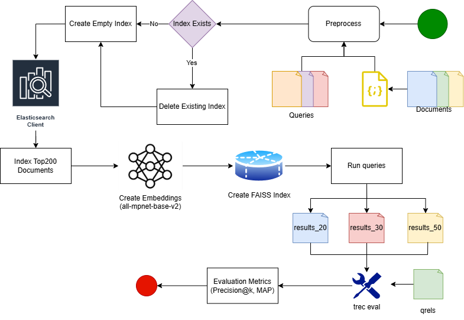

# IR2025 – Αναφορά Φάσης 3 (Bonus)

### Hybird Retrieval με χρήση Elasticsearch και Sentence-Transformers + FAISS

**Μάθημα:** Information Retrieval 2025  
**Φοιτητές(A.M.):** Περικλής Παύλου(3220158), Σωκράτης-Βησσαρίων Γιαννούτσος(3220028)  
**Καθηγήτρια:** Αντωνία Κυριακοπούλου
**Ημερομηνία Υποβολής:** 13 Φεβρουαρίου 2026

---

## Πληροφορίες για την εργασία

Η εργασία αυτή αποτελεί την **Τρίτη και Bonous Φάση (Hybrid Retrieval)** του μαθήματος _Συστήματα Ανάκτησης Πληροφοριών (IR2025)_.  
Στόχος της είναι η υλοποίηση και αξιολόγηση ενός **υβριδικού συστήματος ανάκτησης πληροφορίας**, το οποίο συνδυάζει τις τεχνικές της **κλασικής λεξικογραφικής ανάκτησης** (BM25 μέσω Elasticsearch) με τις τεχνικές της **σημασιολογικής ανάκτησης** (embeddings + FAISS).

Η συλλογή δεδομένων που χρησιμοποιείται είναι η **IR2025**, η οποία περιλαμβάνει **18.316 κείμενα** στο αρχείο **`documents.csv`**,  
ένα σύνολο από **ερωτήματα αναζήτησης** στο αρχείο **`queries.csv`**  
και ένα αρχείο που καθορίζει τις **συναφείς απαντήσεις (relevant documents)** για κάθε ερώτημα στο **`qrels.txt`**, 'οπως ακριβώς και πριν.

Στη φάση αυτή υλοποιείται ένα **pipeline δύο σταδίων (two-stage retrieval)**:

- Στο πρώτο στάδιο, το **Elasticsearch (BM25)** χρησιμοποιείται για την ανάκτηση ενός συνόλου υποψήφιων εγγράφων (top 200 candidates) για κάθε query, βασισμένο σε lexical matching, βασισμένο στην πρώτη φάση της εργασίας.
- Στο δεύτερο στάδιο, τα υποψήφια αυτά έγγραφα μετατρέπονται σε **embeddings** και επαναταξινομούνται με χρήση **FAISS** και **cosine similarity**, ώστε να επιτευχθεί σημασιολογική βελτίωση της κατάταξης (semantic reranking), βασισμένο στην δεύτερη φάση της εργασίας.

Τελικός σκοπός είναι η παραγωγή αρχείων αποτελεσμάτων σε **TREC format** για διαφορετικές τιμές **top-k** (k = 20, 30, 50), όπου τα έγγραφα έχουν ήδη επαναταξινομηθεί με βάση τη σημασιολογική τους ομοιότητα με το query.

Στη συνέχεια, τα αποτελέσματα αξιολογούνται με το εργαλείο **`trec_eval`** χρησιμοποιώντας τις μετρικές:

- **Precision@k**
- **Mean Average Precision (MAP)**

Η φάση αυτή στοχεύει στην κατανόηση της λειτουργίας των **hybrid συστημάτων ανάκτησης**, τα οποία συνδυάζουν τα πλεονεκτήματα των δύο προσεγγίσεων:

- της ακρίβειας του BM25 στις πρώτες θέσεις της κατάταξης,
- και της σημασιολογικής κατανόησης των embeddings.

Παράλληλα, λειτουργεί ως φυσική συνέχεια των προηγούμενων φάσεων, επιτρέποντας την άμεση σύγκριση μεταξύ:

- **Baseline Retrieval (BM25)**  
- **Semantic Retrieval (FAISS + embeddings)**  
- **Hybrid Retrieval (BM25 + FAISS reranking)**

μέσα στο ίδιο πειραματικό πλαίσιο και με τις ίδιες μετρικές αξιολόγησης.

---

## Διάγραμμα Ροής του Συστήματος (Framework)

Το παρακάτω διάγραμμα παρουσιάζει τη συνολική **ροή του Hybrid Retrieval συστήματος**, το οποίο συνδυάζει την κλασική ανάκτηση μέσω **Elasticsearch (BM25)** με σημασιολογική επαναταξινόμηση μέσω **Embeddings + FAISS**.  
Απεικονίζονται τα βασικά στάδια της διαδικασίας — από την προεπεξεργασία και την αρχική ανάκτηση υποψήφιων εγγράφων έως τη δημιουργία embeddings, την επαναταξινόμηση και την τελική αξιολόγηση με το εργαλείο `trec_eval`.

<p align="center">
  
</p>

_Εικόνα 3 – Διάγραμμα ροής του υβριδικού συστήματος ανάκτησης (BM25 + FAISS)._

### Περιγραφή βασικών τμημάτων

- **Documents / Queries**  
  Είσοδος από τα αρχεία `documents.csv` και `queries.csv` της συλλογής IR2025.

- **Preprocess**  
  Καθαρισμός και κανονικοποίηση κειμένου πριν από την ευρετηρίαση και τη δημιουργία embeddings.  
  Το στάδιο αυτό είναι κοινό με τις προηγούμενες φάσεις.

- **Index Exists / Create Empty Index / Delete Existing Index**  
  Έλεγχος ύπαρξης ευρετηρίου στο Elasticsearch.  
  Αν υπάρχει ήδη, διαγράφεται και δημιουργείται νέο κενό ευρετήριο για καθαρή εισαγωγή των εγγράφων.

- **Elasticsearch Client**  
  Ο client που διαχειρίζεται τη δημιουργία του ευρετηρίου και την επικοινωνία με την υπηρεσία αναζήτησης.

- **Index Top200 Documents (BM25)**  
  Για κάθε query, το Elasticsearch χρησιμοποιείται ως πρώτο στάδιο ανάκτησης για την επιστροφή των **top-N (π.χ. top-200) υποψήφιων εγγράφων** με βάση το μοντέλο BM25.

- **Create Embeddings (all-mpnet-base-v2)**  
  Τα υποψήφια έγγραφα που επιστρέφονται από το BM25 μετατρέπονται σε embeddings χρησιμοποιώντας το μοντέλο Sentence-Transformers.  
  Με τον τρόπο αυτό δημιουργείται μια σημασιολογική αναπαράσταση των candidate documents.

- **Create FAISS Index**  
  Δημιουργείται ένας προσωρινός FAISS index πάνω στα embeddings των υποψήφιων εγγράφων για κάθε query, ώστε να γίνει σημασιολογική σύγκριση με το query embedding.

- **Run Queries**  
  Για κάθε query:
  - δημιουργείται το αντίστοιχο query embedding,
  - εκτελείται αναζήτηση στο FAISS index,
  - γίνεται επαναταξινόμηση (reranking) των candidate documents με βάση τη σημασιολογική ομοιότητα.

- **Results (results_20, results_30, results_50)**  
  Τα τελικά αποτελέσματα αποθηκεύονται σε αρχεία **TREC run format** για διαφορετικές τιμές k (20, 30, 50), μετά την υβριδική επαναταξινόμηση.

- **Qrels**  
  Το αρχείο `qrels.txt` περιέχει τα relevance judgments (ground truth) για κάθε query.

- **trec_eval**  
  Το εργαλείο αξιολόγησης που συγκρίνει τα αποτελέσματα του συστήματος με το `qrels.txt`.

- **Evaluation Metrics (Precision@k, MAP)**  
  Υπολογισμός και παρουσίαση των βασικών μετρικών αξιολόγησης:
  - Precision@k
  - Mean Average Precision (MAP)

---

> **Σχέση με Φάση 1 & Φάση 2:**  
> Το Hybrid σύστημα συνδυάζει τα δύο προηγούμενα pipelines:
> - από τη Φάση 1 χρησιμοποιείται το BM25 για την αρχική ανάκτηση υποψηφίων εγγράφων,
> - από τη Φάση 2 χρησιμοποιούνται τα embeddings και το FAISS για τη σημασιολογική επαναταξινόμηση.
>  
> Η διαδικασία αξιολόγησης με `qrels + trec_eval` παραμένει ακριβώς η ίδια, επιτρέποντας άμεση και δίκαιη σύγκριση μεταξύ των τριών προσεγγίσεων (BM25, FAISS, Hybrid).


## 1️⃣ Προεπεξεργασία της Συλλογής IR2025

Η φάση προεπεξεργασίας στο Hybrid Retrieval σύστημα ακολουθεί την ίδια βασική φιλοσοφία με τις προηγούμενες φάσεις, με στόχο την οργάνωση των αρχείων, τον καθαρισμό του κειμένου και την προετοιμασία των δεδομένων τόσο για το Elasticsearch όσο και για τη δημιουργία embeddings.

Στη φάση αυτή γίνεται επίσης αρχικοποίηση όλων των paths, έλεγχος ύπαρξης των απαραίτητων αρχείων και εφαρμογή της ίδιας συνάρτησης καθαρισμού (`preprocess`) σε documents και queries, ώστε να υπάρχει απόλυτη συνέπεια μεταξύ των τριών φάσεων.

---

## 1.1 Αρχικοποίηση Paths και Παραμέτρων Συστήματος

Σε αυτό το στάδιο ορίζονται όλες οι βασικές διαδρομές αρχείων (paths) και οι παράμετροι που χρησιμοποιούνται στο hybrid pipeline.

### Τι κάνει ο κώδικας

- Ορίζει τους βασικούς φακέλους του project:

  - **BASE_DIR**: ο βασικός φάκελος εκτέλεσης του notebook.
  - **IR_DIR**: φάκελος που περιέχει τα δεδομένα της συλλογής IR2025.
  - **EMBED_DIR**: φάκελος αποθήκευσης των embeddings.

- Ορίζει paths για όλα τα κρίσιμα αρχεία εισόδου:

  - `documents.csv` → συλλογή εγγράφων
  - `queries.csv` → σύνολο ερωτημάτων
  - `documents.jsonl` → αρχείο indexing για Elasticsearch
  - `qrels.csv` / `qrels.txt` → relevance judgments
  - `trec_eval.exe` → εργαλείο αξιολόγησης

- Ορίζει paths για embeddings από τις προηγούμενες φάσεις:

  - `doc_embeddings.npy`, `query_embeddings.npy`
  - εναλλακτικά fallback αρχεία για επαναχρησιμοποίηση

- Ορίζει βασικές παραμέτρους του hybrid pipeline:

  - **RESULT_KS** → τιμές k (20, 30, 50)
  - **RUN_TAG** → όνομα run = "HYBRID"
  - **TOP_N_CANDIDATES** → αριθμός υποψήφιων εγγράφων από BM25 (200)
  - **FAISS_USE_COSINE** → χρήση cosine similarity
  - **DOC_BATCH / QUERY_BATCH** → batch sizes για embeddings

```python
BASE_DIR  = Path.cwd()
IR_DIR    = BASE_DIR / "IR2025"
EMBED_DIR = BASE_DIR / "Embeddings"

DOCS_CSV    = IR_DIR / "documents.csv"
QUERIES_CSV = IR_DIR / "queries.csv"
DOCS_JSONL  = IR_DIR / "documents.jsonl"
QRELS_CSV   = IR_DIR / "qrels.csv"
QRELS_TXT   = IR_DIR / "qrels.txt"

TREC_EVAL_BIN = IR_DIR / "trec_eval" / "trec_eval.exe"

DOC_EMBED_MAIN   = EMBED_DIR / "doc_embeddings.npy"
QUERY_EMBED_MAIN = EMBED_DIR / "query_embeddings.npy"
DOC_EMBED_FALL   = EMBED_DIR / "doc_embeddings3.npy"
QUERY_EMBED_FALL = EMBED_DIR / "query_embeddings3.npy"

RESULT_KS = (20, 30, 50)
RUN_TAG   = "HYBRID"

TOP_N_CANDIDATES = 200        
FAISS_USE_COSINE = True  
RECREATE_INDEX   = False       

DOC_BATCH   = 64
QUERY_BATCH = 32
```

## 1.2 Επιλογή Συσκευής Εκτέλεσης (CPU / GPU)

Για τη δημιουργία embeddings γίνεται αυτόματη επιλογή της διαθέσιμης συσκευής:

* Αν υπάρχει GPU → χρήση CUDA
* Διαφορετικά → χρήση CPU

Αυτό επιτρέπει σημαντική επιτάχυνση στο encoding των κειμένων όταν υπάρχει διαθέσιμη GPU.

```python
device = "cuda" if torch.cuda.is_available() else "cpu"
print(device)
```
## 1.3 Καθαρισμός Κειμένου — `preprocess`

Η ίδια συνάρτηση `preprocess` που χρησιμοποιήθηκε και στις προηγούμενες φάσεις εφαρμόζεται και εδώ, ώστε να διατηρηθεί η συνοχή μεταξύ των pipelines.

### Τι κάνει η συνάρτηση

- Αφαιρεί leading/trailing κενά  
- Συμπιέζει πολλαπλά spaces/newlines  
- Αντικαθιστά URLs με `<URL>`  
- Αντικαθιστά emails με `<EMAIL>`  
- Αφαιρεί HTML tags  
- Αφαιρεί control characters  
- Αφαιρεί μονά και διπλά εισαγωγικά  

```python
def preprocess(s):
    if not isinstance(s, str):
        return ""
    s = s.strip()
    s = re.sub(r"\s+", " ", s)
    s = re.sub(r"http\S+|www\.\S+", "<URL>", s)
    s = re.sub(r"\S+@\S+", "<EMAIL>", s)
    s = re.sub(r"<[^>]+>", " ", s)
    s = ''.join(ch for ch in s if ord(ch) >= 32)
    s = re.sub(r"['\"]", "", s)
    return s.strip()
```
>**Κοινό με Φάση 1 & 2**: Η ίδια λογική καθαρισμού χρησιμοποιείται ώστε τα δεδομένα να είναι ομοιόμορφα τόσο για BM25 όσο και για embeddings.

## 1.4 Έλεγχος Ύπαρξης Αρχείων

Πριν ξεκινήσει το pipeline, γίνεται έλεγχος ότι υπάρχουν όλα τα απαραίτητα αρχεία εισόδου.  
Αν κάποιο λείπει, η εκτέλεση σταματά άμεσα για να αποφευχθούν σφάλματα σε επόμενα στάδια.

```python
def ensure_exists(p: Path, name="file"):
    if not p.exists():
        raise SystemExit(f"{name} not found: {p}")
    
ensure_exists(DOCS_CSV, "documents.csv")
ensure_exists(QUERIES_CSV, "queries.csv")
ensure_exists(QRELS_CSV, "qrels.csv")
ensure_exists(TREC_EVAL_BIN, "trec_eval.exe")
```

## 1.5 Φόρτωση Δεδομένων και Έλεγχος Στηλών

Στο στάδιο αυτό διαβάζονται τα αρχεία `documents.csv` και `queries.csv` σε DataFrames και ελέγχεται ότι περιέχουν τις απαραίτητες στήλες:

- `ID` — μοναδικό αναγνωριστικό  
- `Text` — περιεχόμενο εγγράφου / ερωτήματος  

Αν κάποια από αυτές λείπει, το pipeline σταματά.

```python
df_docs = pd.read_csv(DOCS_CSV)
df_queries = pd.read_csv(QUERIES_CSV)

required_doc_cols = {"ID", "Text"}
required_q_cols   = {"ID", "Text"}

if not required_doc_cols.issubset(df_docs.columns):
    raise SystemExit(f"documents.csv missing columns: {required_doc_cols - set(df_docs.columns)}")

if not required_q_cols.issubset(df_queries.columns):
    raise SystemExit(f"queries.csv missing columns: {required_q_cols - set(df_queries.columns)}")
```

## 1.6 Εφαρμογή `preprocess` σε Documents & Queries

Στο τελικό στάδιο της προεπεξεργασίας εφαρμόζεται η συνάρτηση καθαρισμού και στα δύο σύνολα δεδομένων.

- Αφαιρούνται εγγραφές χωρίς `Text`  
- Καθαρίζεται το κείμενο  
- Τα IDs μετατρέπονται σε canonical μορφή  

```python
df_docs = df_docs.dropna(subset=["Text"]).copy()
df_docs["Text"] = df_docs["Text"].astype(str).map(preprocess)
df_docs["ID"] = df_docs["ID"].astype(str).str.strip()

df_queries = df_queries.dropna(subset=["Text"]).copy()
df_queries["Text"] = df_queries["Text"].astype(str).map(preprocess)
df_queries["ID"] = df_queries["ID"].astype(str).str.strip()

print(f"Loaded docs={len(df_docs)} queries={len(df_queries)}")
```


## 2️⃣ Δημιουργία Ευρετηρίου στο Elasticsearch (Hybrid – Candidate Generation)

Στη Φάση 3, το Elasticsearch χρησιμοποιείται ως **πρώτο στάδιο ανάκτησης (candidate generation)**.  
Συγκεκριμένα, για κάθε ερώτημα ανακτώνται τα **top-N υποψήφια έγγραφα** (π.χ. N = 200) με βάση το BM25, και στη συνέχεια αυτά τα candidates επαναταξινομούνται σημασιολογικά με FAISS.

---

## 2.1 Αρχικοποίηση Elasticsearch Client και Κλάσης `SearchES`

**Στόχος.** Σύνδεση στο Elasticsearch και δημιουργία ενός wrapper class που καλύπτει:
- έλεγχο ύπαρξης ευρετηρίου,
- δημιουργία/διαγραφή ευρετηρίου,
- bulk indexing,
- retrieval top-N hits ανά query.

### Τι κάνει αυτό το βήμα

- Συνδέεται στο cluster μέσω `Elasticsearch(host)`.
- Εμφανίζει πληροφορίες σύνδεσης (cluster info) για επιβεβαίωση λειτουργίας.
- Αποθηκεύει τον client στη μεταβλητή `self.es`.

```python
class SearchES:
    def __init__(self, host="http://127.0.0.1:9200"):
        self.es = Elasticsearch(host)
        info = self.es.info()
        print("Connected to Elasticsearch!")
        try:
            pprint(info.body)
        except Exception:
            pprint(info)
```

## 2.2 Ρυθμίσεις BM25, Analyzer και Mapping

**Στόχος.** Ορισμός του τρόπου ανάλυσης κειμένου και scoring στο ευρετήριο `ir2025`.

### Τι περιλαμβάνει

#### BM25 (k1 = 1.4, b = 0.7)

- **k1 (term saturation):** ρυθμίζει πόσο επηρεάζει η συχνότητα εμφάνισης ενός όρου στο έγγραφο.  
- **b (length normalization):** ρυθμίζει πόσο επηρεάζει το μήκος του εγγράφου στο τελικό score.

#### Custom English Analyzer

- **standard tokenizer:** σωστό tokenization για αγγλικά κείμενα  
- **lowercase:** ομογενοποίηση σε πεζά  
- **english_stop:** αφαίρεση κοινών stopwords  
- **porter_stem:** stemming (π.χ. *running → run*)

#### Mapping

- `id` ως `keyword` (σταθερό μοναδικό αναγνωριστικό, χωρίς ανάλυση)  
- `text` ως `text` με analyzer `my_english_analyzer` (ώστε να εφαρμόζεται stemming/stopwords/scoring)

```python
def create_index(self, index_name="ir2025"):
    index_settings = {
        "settings": {
            "similarity": {
                "default": {"type": "BM25", "k1": 1.4, "b": 0.7}
            },
            "analysis": {
                "analyzer": {
                    "my_english_analyzer": {
                        "type": "custom",
                        "tokenizer": "standard",
                        "filter": ["lowercase", "english_stop", "porter_stem"]
                    }
                },
                "filter": {
                    "english_stop": {"type": "stop", "stopwords": "_english_"}
                }
            }
        },
        "mappings": {
            "properties": {
                "id":   {"type": "keyword"},
                "text": {"type": "text", "analyzer": "my_english_analyzer"}
            }
        }
    }
    self.es.indices.create(index=index_name, body=index_settings)
    print(f"Index '{index_name}' created (BM25 + custom analyzer).")
```

## 2.3 Προετοιμασία `documents.jsonl` για Bulk Indexing

**Στόχος.** Να διασφαλιστεί ότι υπάρχει το αρχείο `documents.jsonl`, ώστε να γίνει γρήγορο bulk indexing μέσω Elasticsearch helpers.

### Τι κάνει ο κώδικας

- Αν το `documents.jsonl` δεν υπάρχει:
  - το δημιουργεί από το `df_docs`
  - γράφει κάθε έγγραφο σε μία γραμμή JSON της μορφής:

```json
{"id": "...", "text": "..."}
```
```python
if not DOCS_JSONL.exists():
    print("documents.jsonl missing -> creating...")
    with open(DOCS_JSONL, "w", encoding="utf-8") as f:
        for _, row in df_docs.iterrows():
            rec = {"id": str(row["ID"]).strip(), "text": row["Text"]}
            f.write(json.dumps(rec, ensure_ascii=False) + "\n")
    print("Created:", DOCS_JSONL.resolve())
```


## 2.4 Bulk Εισαγωγή Εγγράφων στο Ευρετήριο (Indexing)

**Στόχος.** Να ευρετηριαστούν τα έγγραφα του `documents.jsonl` στο ευρετήριο `ir2025` με αποδοτικό τρόπο.

### Πώς λειτουργεί

- Η `generate_actions(...)`:
  - διαβάζει το JSONL γραμμή-γραμμή  
  - καθαρίζει το `id`  
  - δημιουργεί bulk actions όπου το `id` χρησιμοποιείται και ως `_id` στον Elasticsearch  

- Η `bulk_index_jsonl(...)`:
  - καλεί `helpers.bulk(...)` ώστε να γίνει μαζική εισαγωγή όλων των documents  

```python
def generate_actions(self, jsonl_path: Path, index_name: str):
    with open(jsonl_path, encoding="utf-8") as f:
        for line in f:
            if not line.strip():
                continue
            doc = json.loads(line)
            doc_id = str(doc["id"]).strip()
            doc["id"] = doc_id
            yield {"_index": index_name, "_id": doc_id, "_source": doc}

def bulk_index_jsonl(self, jsonl_path: Path, index_name="ir2025"):
    actions = self.generate_actions(jsonl_path, index_name)
    success, _ = helpers.bulk(self.es, actions)
    print(f"Indexed {success} documents into '{index_name}'")
```

## 2.5 Έλεγχος / Διαχείριση Ευρετηρίου (Recreate / Reuse)

**Στόχος.** Να εξασφαλιστεί ότι το ευρετήριο υπάρχει και είναι έτοιμο για χρήση στο Hybrid pipeline.

### Τι κάνει ο κώδικας

- Αρχικοποιεί την κλάση `SearchES` και ορίζει το index name.  

- Αν `RECREATE_INDEX=True`, τότε:
  - αν υπάρχει index → διαγραφή  

- Αν δεν υπάρχει index:
  - δημιουργία με `create_index()`  
  - indexing με `bulk_index_jsonl()`  

- Αν υπάρχει ήδη:
  - γίνεται reuse για να αποφευχθεί περιττό indexing  

```python
search = SearchES()
INDEX_NAME = "ir2025"

if RECREATE_INDEX:
    if search.exists(INDEX_NAME):
        search.delete_index(INDEX_NAME)

if not search.exists(INDEX_NAME):
    search.create_index(INDEX_NAME)
    search.bulk_index_jsonl(DOCS_JSONL, INDEX_NAME)
else:
    print(f"Index '{INDEX_NAME}' already exists — using it.")
```

## 2.6 Ανάκτηση Top-N Υποψηφίων (Candidate Retrieval)

**Στόχος.** Για κάθε query, να επιστραφούν τα top-N έγγραφα από τον Elasticsearch, τα οποία θα χρησιμοποιηθούν ως candidates για semantic reranking.

### Πώς λειτουργεί

- Εκτελεί `match` query στο πεδίο `text`  
- Επιστρέφει τα `hits` που περιλαμβάνουν `_id` και `_source`  
- Το `size=N` καθορίζει πόσα candidates θα επιστραφούν (π.χ. N = 200)  

```python
def search_topN(self, query_text: str, N: int, index_name="ir2025"):
    resp = self.es.search(
        index=index_name,
        query={"match": {"text": {"query": query_text}}},
        size=N
    )
    return resp["hits"]["hits"]
```
>**Συνοπτικό σχόλιο**: Το Elasticsearch στη Φάση 3 λειτουργεί ως υποσύστημα candidate generation, παρέχοντας ένα περιορισμένο αλλά υψηλής ποιότητας σύνολο εγγράφων (top-N) πάνω στο οποίο εφαρμόζεται στη συνέχεια η σημασιολογική επαναταξινόμηση με embeddings + FAISS.


## 3️⃣ Hybrid Retrieval (Elasticsearch + Embeddings + FAISS)

Στη Φάση 3 υλοποιείται ένα **Hybrid Retrieval pipeline δύο σταδίων**, όπου:

1) Το **Elasticsearch (BM25)** χρησιμοποιείται για να επιστρέψει ένα περιορισμένο σύνολο **top-N υποψήφιων εγγράφων** (candidates) για κάθε query.  
2) Τα candidates επαναταξινομούνται σημασιολογικά με **Sentence-Transformers embeddings** και **FAISS similarity search**, ώστε να παραχθεί ένα τελικό ranking πιο κοντά στη σημασιολογική πρόθεση του ερωτήματος.

Η υλοποίηση βασίζεται στη λογική **candidate generation + reranking**, η οποία είναι μια από τις πιο συνηθισμένες προσεγγίσεις για hybrid συστήματα, καθώς περιορίζει το υπολογιστικό κόστος της σημασιολογικής αναζήτησης (εφαρμόζεται μόνο στα top-N candidates αντί για όλη τη συλλογή).

---

## 3.1 Αρχικοποίηση Sentence-Transformer Model και Βοηθητικών Δομών

**Στόχος.** Φόρτωση του embedding model και δημιουργία δομών που επιτρέπουν γρήγορη πρόσβαση στο κείμενο κάθε εγγράφου μέσω του ID του.

### Τι κάνει ο κώδικας

- Φορτώνει το μοντέλο `all-mpnet-base-v2` στην επιλεγμένη συσκευή (`cpu` ή `cuda`).
- Δημιουργεί ένα λεξικό `docid_to_text` ώστε να γίνεται άμεση αντιστοίχιση:
  - `docID → Text`
- Δημιουργεί ένα cache `doc_embed_cache` για αποθήκευση embeddings ανά docID (ώστε να αποφεύγονται διπλο-υπολογισμοί όταν χρειάζεται).

```python
model = SentenceTransformer("all-mpnet-base-v2", device=device)

docid_to_text = dict(zip(df_docs["ID"].astype(str), df_docs["Text"].astype(str)))
doc_embed_cache = {}
```

## 3.2 Δημιουργία Embeddings (embed_texts)

**Στόχος**. Μετατροπή λιστών κειμένων σε embeddings με batch processing.

#### Τι κάνει η συνάρτηση

- Δέχεται μια λίστα κειμένων (text_list)
- Επιστρέφει numpy array embeddings
- Μετατρέπει πάντα το αποτέλεσμα σε float32 (απαιτούμενο/βέλτιστο για FAISS)

```python
def embed_texts(text_list, batch_size=64):
    return model.encode(
        text_list, batch_size=batch_size, convert_to_numpy=True, show_progress_bar=False
    ).astype("float32")
```

## 3.3 Ανάκτηση Ενός Document Embedding με Cache (`get_doc_embedding`)

**Στόχος.** Να υπολογίζεται embedding για ένα document μόνο όταν χρειάζεται και να αποθηκεύεται σε cache.

### Πώς λειτουργεί

- Καθαρίζει το `docid`
- Αν υπάρχει ήδη στο `doc_embed_cache`, επιστρέφεται άμεσα
- Αλλιώς:
  - βρίσκει το `text` από `docid_to_text`
  - υπολογίζει embedding
  - το αποθηκεύει στο cache και το επιστρέφει

```python
def get_doc_embedding(docid: str):
    docid = str(docid).strip()
    if docid in doc_embed_cache:
        return doc_embed_cache[docid]
    text = docid_to_text.get(docid)
    if text is None:
        return None
    emb = embed_texts([text], batch_size=1)[0]
    doc_embed_cache[docid] = emb
    return emb
```
>**Σημείωση**: Στο βασικό hybrid pipeline που υλοποιήθηκε, τα embeddings παράγονται μαζικά για τα candidates κάθε query (cand_texts). Η ύπαρξη της get_doc_embedding λειτουργεί ως εναλλακτικός/υποστηρικτικός μηχανισμός για doc-level lookup.

## 3.4 Εξαγωγή Candidate IDs και Texts από Elasticsearch Hits (`extract_candidates_from_hits`)

**Στόχος.** Από τα αποτελέσματα του Elasticsearch να κρατηθούν:

- το `id` του εγγράφου  
- το `text` του εγγράφου  

ώστε να δημιουργηθούν embeddings και να γίνει reranking.

### Τι κάνει η συνάρτηση

- Διατρέχει τα hits του Elasticsearch  
- Παίρνει το `_source` (ή fallback σε `{}`)  
- Ανακτά:
  - `id` από `_source["id"]` (ή fallback σε ES `_id`)  
  - `text` από `_source["text"]`  
- Φιλτράρει κενά/μη έγκυρα entries  
- Επιστρέφει δύο παράλληλες λίστες:
  - `cand_ids`  
  - `cand_texts`  

```python
def extract_candidates_from_hits(hits):
    cand_ids = []
    cand_texts = []
    for h in hits:
        src = h.get("_source", {}) or {}
        did = str(src.get("id", h.get("_id", ""))).strip()
        txt = src.get("text", None)
        if did and isinstance(txt, str) and txt.strip():
            cand_ids.append(did)
            cand_texts.append(txt)
    return cand_ids, cand_texts
```

## 3.5 Εκτέλεση Hybrid Retrieval και Παραγωγή Αποτελεσμάτων (`run_hybrid_IR`)

**Στόχος.** Για κάθε query να παραχθούν τελικά αποτελέσματα hybrid reranking και να γραφτούν σε αρχεία TREC format για k = 20, 30, 50.

### Βασική λογική (ανά query)

- **Candidate generation με Elasticsearch:** επιστρέφει `topN=200` έγγραφα  
- **Embeddings για:**
  - το query (μία φορά για όλα τα queries)  
  - τα candidate documents ανά query  
- **FAISS reranking:**
  - δημιουργείται προσωρινός FAISS index πάνω στα candidate embeddings  
  - γίνεται similarity search για το query embedding  
- **Αποθήκευση σε TREC format:**
  - γράφονται τα top-k αποτελέσματα σε `results_hybrid_20/30/50.txt`  

### Κώδικας

```python
def run_hybrid_IR(
    ks=(20, 30, 50),
    topN=200,
    index_name="ir2025",
    run_tag="HYBRID",
    faiss_use_cosine=True,
):
    out_files = {k: open(IR_DIR / f"results_hybrid_{k}.txt", "w", encoding="utf-8") for k in ks}
    print(f"Running HYBRID: ES topN={topN} -> embeddings -> FAISS -> ks={ks}")

    # Embeddings for queries (computed once)
    q_emb_all = embed_texts(df_queries["Text"].astype(str).tolist(), batch_size=32)
    if faiss_use_cosine:
        faiss.normalize_L2(q_emb_all)

    for q_idx, qrow in df_queries.iterrows():
        qid = str(qrow["ID"]).strip()
        qtext = str(qrow["Text"])

        # Stage 1: Elasticsearch candidates
        hits = search.search_topN(qtext, topN, index_name=index_name)

        cand_ids, cand_texts = extract_candidates_from_hits(hits)
        if not cand_ids:
            continue

        # Stage 2: Embeddings for candidates
        cand_embs = embed_texts(cand_texts, batch_size=64)

        # Build FAISS index over candidates and rerank
        if faiss_use_cosine:
            faiss.normalize_L2(cand_embs)
            idx = faiss.IndexFlatIP(cand_embs.shape[1])
        else:
            idx = faiss.IndexFlatL2(cand_embs.shape[1])

        idx.add(cand_embs)

        # Search + write
        q_vec = q_emb_all[q_idx].reshape(1, -1).astype("float32")
        D, I = idx.search(q_vec, max(ks))

        for k in ks:
            f = out_files[k]
            for rank, (local_i, score) in enumerate(zip(I[0][:k], D[0][:k]), start=1):
                f.write(f"{qid} Q0 {cand_ids[int(local_i)]} {rank} {float(score):.6f} {run_tag}\n")

    for f in out_files.values():
        f.close()

    print("Done HYBRID results.")
```

## 3.6 Εκτέλεση του Hybrid Pipeline

Το hybrid pipeline εκτελείται με τις παραμέτρους που έχουν οριστεί στο initialization:

- `ks = (20, 30, 50)`
- `topN = 200`
- `run_tag = "HYBRID"`
- cosine similarity (`FAISS_USE_COSINE=True`)

```python
run_hybrid_IR(
    ks=RESULT_KS,
    topN=TOP_N_CANDIDATES,
    index_name=INDEX_NAME,
    run_tag=RUN_TAG,
    faiss_use_cosine=FAISS_USE_COSINE
)
```
### Κατά την εκτέλεση εμφανίζεται το μήνυμα:
```
Running HYBRID: ES topN=200 -> embeddings -> FAISS -> ks=(20, 30, 50)
```
που επιβεβαιώνει ότι το pipeline ξεκίνησε σωστά με το συγκεκριμένο configuration.

## 4️⃣ Αξιολόγηση Αποτελεσμάτων με `trec_eval` (Κλάση `TrecEvaluator`)

Στη Φάση 3 η αξιολόγηση των αποτελεσμάτων γίνεται με το εργαλείο **`trec_eval`**, όπως και στις προηγούμενες φάσεις.  
Για να αυτοματοποιηθεί η διαδικασία, υλοποιείται η κλάση **`TrecEvaluator`**, η οποία:

- διασφαλίζει ότι υπάρχει το αρχείο **`qrels.txt`** σε σωστό TREC format,
- εκτελεί το `trec_eval` για κάθε run αρχείο (`results_hybrid_20/30/50.txt`),
- κάνει parsing των βασικών μετρικών (**P@5, P@10, P@15, P@20, MAP**),
- και παράγει έναν συγκεντρωτικό πίνακα αποτελεσμάτων.

---

## 4.1 Αρχικοποίηση και Έλεγχοι (`__init__`)

**Στόχος.** Να γίνει αρχικοποίηση του evaluator με τα σωστά paths και να επιβεβαιωθεί ότι:
- το `trec_eval.exe` υπάρχει,
- το `qrels.txt` υπάρχει (ή δημιουργείται από το `qrels.csv`).

### Τι κάνει ο κώδικας

- Αποθηκεύει τα paths (`data_dir`, `qrels_csv_path`, `qrels_txt_path`, `trec_eval_bin`).
- Καλεί `_ensure_trec_qrels()` ώστε να δημιουργηθεί `qrels.txt` αν δεν υπάρχει.
- Κάνει safety checks για ύπαρξη `trec_eval` και `qrels.txt`.

```python
class TrecEvaluator:
    def __init__(self, data_dir: Path, qrels_csv_path: Path, qrels_txt_path: Path, trec_eval_bin: Path):
        self.data_dir = Path(data_dir)
        self.qrels_csv_path = Path(qrels_csv_path)
        self.qrels_txt_path = Path(qrels_txt_path)
        self.trec_eval_bin = Path(trec_eval_bin)

        self._ensure_trec_qrels()

        if not self.trec_eval_bin.exists():
            raise SystemExit(f"trec_eval not found: {self.trec_eval_bin}")
        if not self.qrels_txt_path.exists():
            raise SystemExit(f"qrels.txt not found: {self.qrels_txt_path}")

        print("Using trec_eval:", self.trec_eval_bin)
        print("Using qrels:", self.qrels_txt_path)
```

## 4.2 Δημιουργία `qrels.txt` από `qrels.csv` (`_fix_and_write_qrels`)

**Στόχος.** Μετατροπή του `qrels.csv` σε **TREC qrels format**, ώστε να μπορεί να χρησιμοποιηθεί από το `trec_eval`.

### Τι κάνει ο κώδικας

- Διαβάζει το `qrels.csv` (με auto-detect separator).  
- Καθαρίζει κενές γραμμές και whitespace.  
- Προσπαθεί να εντοπίσει σωστά τις στήλες:
  - `qid` (πρώτη στήλη)  
  - `docid` (η στήλη που ταιριάζει περισσότερο με docIDs που εμφανίζονται στα results)  
  - `rel` (στήλη με αριθμητικές τιμές relevance)  

- Γράφει το `qrels.txt` στην κλασική μορφή:

```
qid 0 docid rel
```


```python
def _fix_and_write_qrels(self):
    dfq = pd.read_csv(self.qrels_csv_path, sep=None, engine="python", encoding="utf-8-sig")
    dfq = dfq.dropna(how="all")
    dfq = dfq.astype(str).applymap(lambda x: x.strip())
    cols = list(dfq.columns)
    qid_col = cols[0]

    res_docids = set()
    sample = self.data_dir / "results_hybrid_20.txt"
    if sample.exists():
        with open(sample, encoding="utf-8", errors="replace") as f:
            for ln in f:
                parts = re.split(r"\s+", ln.strip())
                if len(parts) >= 3:
                    res_docids.add(parts[2])

    candidates = []
    for c in cols:
        vals = dfq[c].dropna().astype(str).str.strip().unique()[:200].tolist()
        inter = len(set(vals) & res_docids) if res_docids else 0
        num_like = sum(1 for v in vals if re.match(r"^\d+$", v))
        candidates.append((c, inter, num_like))

    docid_col = max(candidates, key=lambda x: (x[1], x[2]))[0]

    rel_col = None
    for c in cols:
        if c in (qid_col, docid_col):
            continue
        sample_vals = dfq[c].dropna().astype(str).str.strip().unique()[:50].tolist()
        if sample_vals and all(re.match(r"^\d+$", v) for v in sample_vals):
            rel_col = c
            break
    if rel_col is None:
        others = [c for c in cols if c not in (qid_col, docid_col)]
        rel_col = others[-1] if others else cols[-1]

    with open(self.qrels_txt_path, "w", encoding="utf-8") as out:
        for _, row in dfq.iterrows():
            qid = str(row[qid_col]).strip()
            docid = str(row[docid_col]).strip()
            rel = str(row[rel_col]).strip()
            if not qid or not docid or docid.upper() == "Q0":
                continue
            out.write(f"{qid} 0 {docid} {rel}\n")

    print(f"Created qrels.txt from qrels.csv (qid={qid_col}, docid={docid_col}, rel={rel_col})")
```

## 4.3 Έλεγχος / Δημιουργία qrels.txt (_ensure_trec_qrels)

**Στόχος**. Να υπάρχει πάντοτε διαθέσιμο qrels.txt.
- Αν υπάρχει ήδη → χρησιμοποιείται
- Αν δεν υπάρχει → δημιουργείται από το qrels.csv

```python
def _ensure_trec_qrels(self):
    if self.qrels_txt_path.exists():
        print("Using existing qrels.txt:", self.qrels_txt_path)
        return
    print("qrels.txt not found -> creating from qrels.csv ...")
    self._fix_and_write_qrels()
```

## 4.4 Εκτέλεση `trec_eval` και Parsing Μετρικών (`_run_trec_eval`)

**Στόχος.** Εκτέλεση του `trec_eval` για ένα συγκεκριμένο run αρχείο και εξαγωγή βασικών μετρικών.

### Τι κάνει

- Εκτελεί την εντολή:
```
trec_eval qrels.txt results_hybrid_k.txt -m all_trec
```


- Κάνει parsing της εξόδου και κρατά:

  - `MAP` (metric `map`)  
  - `P@5`, `P@10`, `P@15`, `P@20` (metrics `P_5`, `P_10`, κ.λπ.)  

```python
def _run_trec_eval(self, results_file: Path):
    cmd = f"\"{self.trec_eval_bin}\" \"{self.qrels_txt_path}\" \"{results_file}\" -m all_trec"
    proc = subprocess.run(cmd, capture_output=True, text=True, shell=True)
    if proc.returncode != 0:
        print(proc.stderr)
        raise SystemExit(f"trec_eval failed for {results_file}")

    parsed = {}
    for line in proc.stdout.strip().splitlines():
        parts = re.split(r"\s+", line.strip())
        if len(parts) < 3:
            continue
        metric, target, value = parts[0], parts[1], parts[-1]
        if target.lower() != "all":
            continue
        if metric.lower() == "map":
            parsed["MAP"] = float(value); continue
        m = re.match(r"^P_(\d+)$", metric)
        if m:
            parsed[f"P@{int(m.group(1))}"] = float(value)

    return {
        "P@5": parsed.get("P@5"),
        "P@10": parsed.get("P@10"),
        "P@15": parsed.get("P@15"),
        "P@20": parsed.get("P@20"),
        "MAP": parsed.get("MAP"),
    }
```
## 4.5 Αξιολόγηση Πολλαπλών k και Συνοπτικό Output (`evaluate`)

**Στόχος.** Αξιολόγηση για k ∈ {20, 30, 50} και παραγωγή ενός συγκεντρωτικού πίνακα αποτελεσμάτων.

### Τι κάνει

- Για κάθε `k`:
  - εντοπίζει το run αρχείο `results_hybrid_k.txt`  
  - τρέχει `trec_eval`  
  - αποθηκεύει τις μετρικές σε μία γραμμή  

- Δημιουργεί ένα DataFrame με τις μετρικές ταξινομημένο ως προς `retrieval_k`.

- Προαιρετικά γράφει και ένα summary αρχείο `trec_eval_hybrid_summary.txt` σε format παρόμοιο με την έξοδο του `trec_eval`.

```python
def evaluate(self, ks=(20,30,50), out_summary_path: Path = None):
    rows = []
    for k in ks:
        results_file = self.data_dir / f"results_hybrid_{k}.txt"
        ensure_exists(results_file, f"results_hybrid_{k}.txt")
        metrics = self._run_trec_eval(results_file)
        rows.append({"retrieval_k": k, **metrics})

    df = pd.DataFrame(rows).sort_values("retrieval_k").reset_index(drop=True)
    print(df)

    if out_summary_path:
        with open(out_summary_path, "w", encoding="utf-8") as f:
            for _, r in df.iterrows():
                f.write(f"# summary for results_hybrid_{int(r['retrieval_k'])}.txt\n")
                for kk in [5, 10, 15, 20]:
                    f.write(f"P_{kk}\tall\t{r[f'P@{kk}']:.4f}\n")
                f.write(f"map\tall\t{r['MAP']:.4f}\n\n")
        print("Wrote:", out_summary_path)

    return df
```

## 4.6 Εκτέλεση Αξιολόγησης για Hybrid Runs

Τέλος, γίνεται αρχικοποίηση του evaluator και αξιολόγηση για **k = (20, 30, 50)**:

```python
evaluator = TrecEvaluator(
    data_dir=IR_DIR,
    qrels_csv_path=QRELS_CSV,
    qrels_txt_path=QRELS_TXT,
    trec_eval_bin=TREC_EVAL_BIN
)

df_hybrid = evaluator.evaluate(
    ks=RESULT_KS,
    out_summary_path=IR_DIR / "trec_eval_hybrid_summary.txt"
)
```

> **Με την εκτέλεση αυτή**:

παράγεται ο πίνακας αποτελεσμάτων για τα Hybrid runs,
και δημιουργείται το αρχείο trec_eval_hybrid_summary.txt για αποθήκευση/αναφορά των βασικών μετρικών.

## 5️⃣ Παρουσίαση και Ανάλυση Αποτελεσμάτων Hybrid Retrieval

### 5.1 Παρουσίαση Αποτελεσμάτων

Παρακάτω παρουσιάζονται οι μετρικές αξιολόγησης του **Hybrid Retrieval (BM25 + Embeddings + FAISS reranking)** για τιμές _k = 20, 30, 50_.

| retrieval_k | P@5 | P@10 | P@15 | P@20 | MAP   |
|-------------|-----|------|------|------|-------|
| 20          | 0.62| 0.47 | 0.4267 | 0.39 | 0.3410 |
| 30          | 0.62| 0.47 | 0.4267 | 0.39 | 0.3933 |
| 50          | 0.62| 0.47 | 0.4267 | 0.39 | 0.4449 |

Παρατηρούμε ότι:

- Οι τιμές **Precision@k** παραμένουν **σταθερές** για όλα τα retrieval depths:
  - **P@5 = 0.62**
  - **P@10 = 0.47**
  - **P@15 ≈ 0.4267**
  - **P@20 = 0.39**

  Αυτό δείχνει ότι η ποιότητα των πρώτων θέσεων της κατάταξης δεν αλλάζει όταν αυξάνεται το πλήθος των τελικών αποτελεσμάτων.  
  Δηλαδή, τα πιο σχετικά έγγραφα που εντοπίζονται στις κορυφαίες θέσεις είναι σχεδόν τα ίδια είτε ζητάμε 20, είτε 30, είτε 50 αποτελέσματα.

- Αντίθετα, η **MAP** παρουσιάζει σαφή αύξηση:

  - MAP@20 → **0.3410**
  - MAP@30 → **0.3933**
  - MAP@50 → **0.4449**

  Όσο αυξάνεται το _k_, το σύστημα επιστρέφει περισσότερα σχετικά έγγραφα σε χαμηλότερες θέσεις, βελτιώνοντας έτσι τον συνολικό μέσο όρο precision σε όλο το ranking.

Συμπέρασμα:  
Το hybrid σύστημα διατηρεί σταθερή ποιότητα στις κορυφαίες θέσεις, ενώ η συνολική ποιότητα ταξινόμησης (MAP) βελτιώνεται όσο αυξάνεται το retrieval depth.

---

### 5.2 Σύγκριση με τις Προηγούμενες Φάσεις (BM25 vs Semantic vs Hybrid)

Συγκρίνοντας τα αποτελέσματα του Hybrid Retrieval με τις Φάσεις 1 και 2, προκύπτουν σημαντικά συμπεράσματα.

#### Σύγκριση Precision@k

- **BM25 (Φάση 1):**
  - P@5 = 0.90  
  - P@10 = 0.74  
  - P@15 ≈ 0.713  
  - P@20 = 0.645  

- **Semantic Retrieval (Φάση 2):**
  - P@5 = 0.60  
  - P@10 = 0.43  
  - P@15 ≈ 0.387  
  - P@20 = 0.355  

- **Hybrid Retrieval (Φάση 3):**
  - P@5 = 0.62  
  - P@10 = 0.47  
  - P@15 ≈ 0.427  
  - P@20 = 0.39  

Παρατηρούμε ότι:

- Το Hybrid σύστημα βελτιώνει σταθερά το Semantic retrieval:
  - +0.02 στο P@5  
  - +0.04 στο P@10  
  - +0.04 περίπου στο P@15  
  - +0.035 στο P@20  

- Ωστόσο, εξακολουθεί να υπολείπεται σημαντικά του BM25 στις κορυφαίες θέσεις.

#### Σύγκριση MAP

- **BM25:**
  - MAP@20 ≈ 0.713  
  - MAP@30 ≈ 0.775  
  - MAP@50 ≈ 0.792  

- **Semantic Retrieval:**
  - MAP@20 = 0.302  
  - MAP@30 = 0.346  
  - MAP@50 = 0.371  

- **Hybrid Retrieval:**
  - MAP@20 = 0.341  
  - MAP@30 = 0.393  
  - MAP@50 = 0.445  

Παρατηρούμε ότι:

- Το Hybrid σύστημα:
  - Βελτιώνει σημαντικά το Semantic retrieval σε όλο το retrieval depth.
  - Παραμένει όμως χαμηλότερο από το BM25 baseline.

Συνολικά:

- Το **BM25** παραμένει το ισχυρότερο μοντέλο για κορυφαία αποτελέσματα.
- Το **Semantic retrieval** έχει τη χαμηλότερη απόδοση.
- Το **Hybrid** βρίσκεται ανάμεσα στα δύο:
  - καλύτερο από semantic,
  - αλλά όχι τόσο ισχυρό όσο το καθαρό BM25.

---

### 5.3 Διαισθητική Ερμηνεία των Αποτελεσμάτων

Η συμπεριφορά του hybrid συστήματος εξηγείται από τον τρόπο λειτουργίας του pipeline:

1. **Stage 1 — Candidate Generation (BM25):**  
   Ο Elasticsearch επιστρέφει τα top-N έγγραφα με βάση lexical matching.  
   Αυτό εξασφαλίζει ότι τα αρχικά αποτελέσματα είναι ήδη σχετικά υψηλής ποιότητας.

2. **Stage 2 — Semantic Reranking (Embeddings + FAISS):**  
   Τα υποψήφια έγγραφα επαναταξινομούνται με βάση σημασιολογική ομοιότητα.

Αυτό δημιουργεί έναν ενδιαφέροντα συμβιβασμό:

- Το BM25 είναι πολύ καλό στο να εντοπίζει έγγραφα με ισχυρή λέξη-προς-λέξη αντιστοίχιση.
- Τα embeddings εντοπίζουν σημασιολογικές ομοιότητες, αλλά συχνά εξομαλύνουν τις διαφορές μεταξύ εγγράφων.

Ως αποτέλεσμα:

- Σε κάποιες περιπτώσεις το semantic reranking:
  - μετακινεί πραγματικά σχετικά έγγραφα ελαφρώς πιο χαμηλά,
  - μειώνοντας την Precision στις κορυφαίες θέσεις σε σχέση με το BM25.

- Παρ’ όλα αυτά:
  - το Hybrid ανακαλύπτει περισσότερα σχετικά έγγραφα σε μεγαλύτερο βάθος,
  - οδηγώντας σε σημαντική αύξηση της MAP σε σχέση με το καθαρό semantic retrieval.

Διαισθητικά:

- Το **BM25** είναι εξαιρετικό για "exact matching".
- Το **Semantic retrieval** είναι καλό για "meaning matching".
- Το **Hybrid** προσπαθεί να συνδυάσει τα δύο:
  - χρησιμοποιεί το BM25 για να βρει καλά candidates,
  - και embeddings για να τα βελτιώσει σημασιολογικά.

Έτσι, το Hybrid σύστημα αποτελεί έναν ενδιάμεσο μηχανισμό που:
- διορθώνει αρκετές αδυναμίες του pure semantic retrieval,
- αλλά δεν ξεπερνά πλήρως την ακρίβεια του BM25 στις κορυφαίες θέσεις.


## 6️⃣ Συμπεράσματα και Σχετική Βιβλιογραφία

### 6.1 Συμπεράσματα

Η εργασία αυτή εξερεύνησε διαδοχικά τρεις διαφορετικές προσεγγίσεις στην Ανάκτηση Πληροφορίας:

1. **Φάση 1 – Lexical Retrieval (BM25 μέσω Elasticsearch)**
2. **Φάση 2 – Semantic Retrieval (Embeddings + FAISS)**
3. **Φάση 3 – Hybrid Retrieval (BM25 candidate generation + semantic reranking)**

Η σύγκριση των αποτελεσμάτων οδηγεί σε ορισμένα βασικά συμπεράσματα:

- Το **BM25** αποδείχθηκε το πιο ισχυρό σύστημα για τις κορυφαίες θέσεις της κατάταξης:
  - Υψηλότερα Precision@k
  - Πολύ υψηλή MAP
  - Σταθερά και αξιόπιστα αποτελέσματα

- Το **Semantic Retrieval**:
  - Παρουσίασε χαμηλότερη ακρίβεια στις πρώτες θέσεις
  - Εμφάνισε όμως βελτίωση της MAP όσο αυξανόταν το retrieval depth
  - Ανέδειξε τη σημασία της σημασιολογικής ομοιότητας πέρα από το απλό lexical matching

- Το **Hybrid Retrieval**:
  - Βελτίωσε αισθητά την απόδοση του καθαρού semantic retrieval
  - Διατήρησε την ισχυρή candidate selection του BM25
  - Πρόσθεσε semantic reranking που εντόπισε επιπλέον σχετικά έγγραφα

Συγκεκριμένα:

- Precision@k:
  - BM25 > Hybrid > Semantic
- MAP:
  - BM25 παραμένει πρώτο
  - Hybrid δεύτερο
  - Semantic τρίτο

Αυτό δείχνει ότι:

- Το BM25 είναι εξαιρετικά αποτελεσματικό στο να βρίσκει τα πιο σχετικά έγγραφα όταν υπάρχει ισχυρή λέξη-προς-λέξη αντιστοίχιση.
- Τα embeddings προσφέρουν σημασιολογική κατανόηση, αλλά δεν αντικαθιστούν πλήρως τη lexical πληροφορία.
- Ο συνδυασμός των δύο (Hybrid) αποτελεί μια πιο ισορροπημένη προσέγγιση.

Διαισθητικά:

- Το BM25 λειτουργεί σαν "ακριβής ανιχνευτής λέξεων".
- Τα embeddings λειτουργούν σαν "ανιχνευτής νοήματος".
- Το Hybrid σύστημα προσπαθεί να αξιοποιήσει και τα δύο επίπεδα πληροφορίας:
  - πρώτα βρίσκει καλά candidates με BM25,
  - μετά τα επαναταξινομεί με βάση τη σημασιολογική ομοιότητα.

Η συνολική εικόνα της εργασίας δείχνει ξεκάθαρα ότι:

- Τα κλασικά lexical μοντέλα παραμένουν εξαιρετικά ισχυρά baselines.
- Τα semantic μοντέλα προσθέτουν σημαντική πληροφορία σε μεγαλύτερο βάθος ανάκτησης.
- Τα hybrid συστήματα αποτελούν μια φυσική εξέλιξη των IR pipelines, συνδυάζοντας την ακρίβεια του BM25 με τη γενίκευση των embeddings.

---

### 6.2 Σχετική Βιβλιογραφία

Η εργασία βασίστηκε σε συνδυασμό πηγών που καλύπτουν:

- Κλασική Ανάκτηση Πληροφορίας (BM25, Elasticsearch)
- Semantic Retrieval (Sentence Transformers, Embeddings)
- Approximate Nearest Neighbor Search (FAISS)
- Hybrid Information Retrieval
- Αξιολόγηση με TREC μετρικές

---

### Elasticsearch & BM25

- **Elasticsearch – Official Documentation**  
  https://www.elastic.co/guide/en/elasticsearch/reference/current/index.html  
  Επίσημη τεκμηρίωση για index creation, analyzers, scoring και BM25.

- **Practical BM25 (Elastic Blog)**  
  https://www.elastic.co/blog/practical-bm25-part-1-how-shards-affect-relevance-scoring-in-elasticsearch  
  https://www.elastic.co/blog/practical-bm25-part-2-the-bm25-algorithm-and-its-variables  
  Αναλυτική επεξήγηση του BM25 scoring και των παραμέτρων του.

- **Okapi BM25 – Wikipedia**  
  https://en.wikipedia.org/wiki/Okapi_BM25  
  Θεωρητική παρουσίαση του BM25 και των βασικών εννοιών του.

- **Apache Lucene – BM25Similarity**  
  https://lucene.apache.org/core/9_0_0/core/org/apache/lucene/search/similarities/BM25Similarity.html  
  Περιγραφή του scoring μηχανισμού πάνω στον οποίο βασίζεται το Elasticsearch.

---

### Semantic Retrieval & Embeddings

- **Sentence-Transformers – Official Documentation**  
  https://www.sbert.net  
  Τεκμηρίωση για sentence embeddings, semantic similarity και χρήση pretrained μοντέλων.

- **Semantic Search Examples (SBERT)**  
  https://www.sbert.net/examples/applications/semantic-search/README.html  
  Πρακτικά παραδείγματα semantic retrieval pipelines.

---

### FAISS & Similarity Search

- **FAISS – Facebook AI Similarity Search**  
  https://github.com/facebookresearch/faiss  
  Επίσημο αποθετήριο για nearest neighbor search σε embedding spaces.

- **FAISS Wiki / Tutorials**  
  https://github.com/facebookresearch/faiss/wiki  
  Αναλυτική περιγραφή index types και similarity search.

- **FAISS Explanation (Pinecone)**  
  https://www.pinecone.io/learn/faiss/  
  Επεξήγηση της σχέσης cosine similarity, inner product και L2 normalization.

---

### Hybrid Information Retrieval

- **Hybrid Search (Lexical + Semantic Retrieval)**  
  Ο συνδυασμός BM25 candidate generation με semantic reranking αποτελεί πλέον
  βασική πρακτική σε σύγχρονα IR συστήματα (search engines, QA systems, RAG pipelines),
  καθώς εκμεταλλεύεται:
  - την ακρίβεια του lexical matching
  - και τη γενίκευση των embeddings.

- **TREC – Text Retrieval Conference (NIST)**  
  https://trec.nist.gov/  
  Επίσημος φορέας αξιολόγησης συστημάτων ανάκτησης πληροφορίας και πηγή των μετρικών P@k και MAP.

- **trec_eval Tool**  
  https://trec.nist.gov/trec_eval/  
  Εργαλείο αξιολόγησης που χρησιμοποιήθηκε για τη μέτρηση της απόδοσης όλων των φάσεων.

---

### YouTube Εκπαιδευτικό Υλικό

- **A No-Nonsense Intro to BM25**  
  https://www.youtube.com/watch?v=TW9vHU1GpU4  

- **BM25 Scoring Explained**  
  https://www.youtube.com/watch?v=wW5OtLjKr90  

- **Sentence Transformers Explained**  
  https://www.youtube.com/watch?v=G5M4vPp5p9Q  

- **FAISS Tutorial – Nearest Neighbor Search at Scale**  
  https://www.youtube.com/watch?v=8odY8a1sDg8  

- **Information Retrieval Evaluation (Precision, MAP)**  
  https://www.youtube.com/watch?v=5j4hG3mZp8E  

Τα παραπάνω υλικά βοήθησαν στην κατανόηση τόσο της θεωρίας όσο και της πρακτικής
υλοποίησης των lexical, semantic και hybrid συστημάτων ανάκτησης που αναπτύχθηκαν
στην εργασία.
